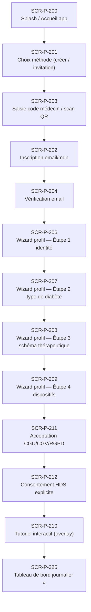

# J-P-01 — Onboarding patient invité par médecin

> 🟢 Priorité **MVP** · Persona **Patient nouveau (invitation)** · 13 écrans · 168 SP cumulés (×plat)

---

## Séquence d'écrans

1. [SCR-P-200 — Splash / Accueil app](../by-category/01-onboarding/SCR-P-200-splash-accueil-app.md)
2. [SCR-P-201 — Choix méthode (créer / invitation)](../by-category/01-onboarding/SCR-P-201-choix-methode-creer-invitation.md)
3. [SCR-P-203 — Saisie code médecin / scan QR](../by-category/01-onboarding/SCR-P-203-saisie-code-medecin-scan-qr-ios.md)
4. [SCR-P-202 — Inscription email/mdp](../by-category/01-onboarding/SCR-P-202-inscription-email-mdp.md)
5. [SCR-P-204 — Vérification email](../by-category/01-onboarding/SCR-P-204-verification-email.md)
6. [SCR-P-206 — Wizard profil — Étape 1 identité](../by-category/01-onboarding/SCR-P-206-wizard-profil-etape-1-identite.md)
7. [SCR-P-207 — Wizard profil — Étape 2 type de diabète](../by-category/01-onboarding/SCR-P-207-wizard-profil-etape-2-type-de-diabete.md)
8. [SCR-P-208 — Wizard profil — Étape 3 schéma thérapeutique](../by-category/01-onboarding/SCR-P-208-wizard-profil-etape-3-schema-therapeutique.md)
9. [SCR-P-209 — Wizard profil — Étape 4 dispositifs](../by-category/01-onboarding/SCR-P-209-wizard-profil-etape-4-dispositifs.md)
10. [SCR-P-211 — Acceptation CGU/CGV/RGPD](../by-category/01-onboarding/SCR-P-211-acceptation-cgu-cgv-rgpd.md)
11. [SCR-P-212 — Consentement HDS explicite](../by-category/01-onboarding/SCR-P-212-consentement-hds-explicite.md)
12. [SCR-P-210 — Tutoriel interactif (overlay)](../by-category/01-onboarding/SCR-P-210-tutoriel-interactif-overlay.md)
13. [SCR-P-325 — Tableau de bord journalier ⭐](../by-category/15-suivi/SCR-P-325-tableau-de-bord-journalier.md)

---

## Représentation flow (Mermaid)

---

## Notes

- Ce parcours doit être validé par un PO produit avant développement
- Tests E2E recommandés sur le parcours complet (1 spec par parcours critique)
- Le SP cumulé tient compte du multiplicateur plateformes (×3 pour 'all', ×2 pour 'mobile')
