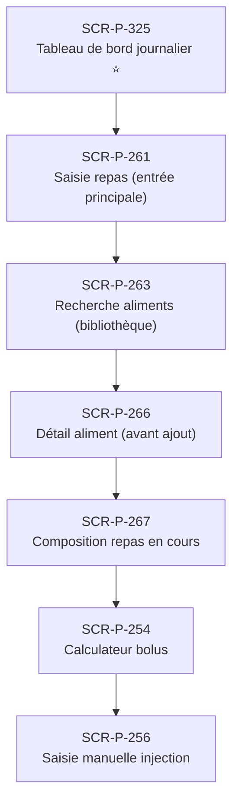

# J-P-02 — Saisie repas + calcul bolus + injection

> 🟢 Priorité **MVP** · Persona **Patient quotidien** · 7 écrans · 132 SP cumulés (×plat)

---

## Séquence d'écrans

1. [SCR-P-325 — Tableau de bord journalier ⭐](../by-category/15-suivi/SCR-P-325-tableau-de-bord-journalier.md)
2. [SCR-P-261 — Saisie repas (entrée principale)](../by-category/06-repas/SCR-P-261-saisie-repas-entree-principale.md)
3. [SCR-P-263 — Recherche aliments (bibliothèque)](../by-category/06-repas/SCR-P-263-recherche-aliments-bibliotheque.md)
4. [SCR-P-266 — Détail aliment (avant ajout)](../by-category/06-repas/SCR-P-266-detail-aliment-avant-ajout.md)
5. [SCR-P-267 — Composition repas en cours](../by-category/06-repas/SCR-P-267-composition-repas-en-cours.md)
6. [SCR-P-254 — Calculateur bolus](../by-category/05-insuline/SCR-P-254-calculateur-bolus.md)
7. [SCR-P-256 — Saisie manuelle injection](../by-category/05-insuline/SCR-P-256-saisie-manuelle-injection.md)

---

## Représentation flow (Mermaid)

---

## Notes

- Ce parcours doit être validé par un PO produit avant développement
- Tests E2E recommandés sur le parcours complet (1 spec par parcours critique)
- Le SP cumulé tient compte du multiplicateur plateformes (×3 pour 'all', ×2 pour 'mobile')
