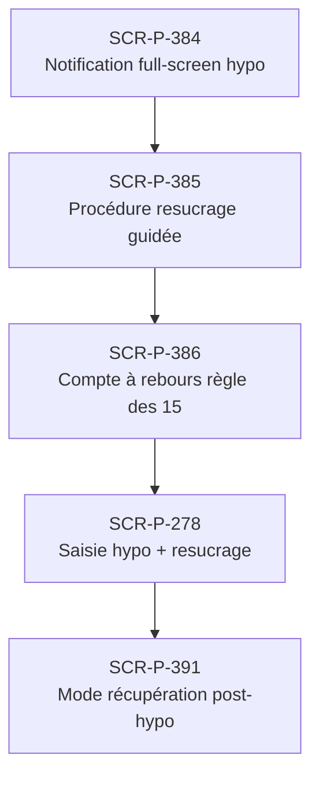

# J-P-03 — Réaction urgence hypo (auto-déclenchée)

> 🟢 Priorité **MVP** · Persona **Patient T1** · 5 écrans · 96 SP cumulés (×plat)

---

## Séquence d'écrans

1. [SCR-P-384 — Notification full-screen hypo](../by-category/27-urgences-hypo/SCR-P-384-notification-full-screen-hypo-ios.md)
2. [SCR-P-385 — Procédure resucrage guidée](../by-category/27-urgences-hypo/SCR-P-385-procedure-resucrage-guidee.md)
3. [SCR-P-386 — Compte à rebours règle des 15](../by-category/27-urgences-hypo/SCR-P-386-compte-a-rebours-regle-des-15.md)
4. [SCR-P-278 — Saisie hypo + resucrage](../by-category/08-journal/SCR-P-278-saisie-hypo-resucrage.md)
5. [SCR-P-391 — Mode récupération post-hypo](../by-category/27-urgences-hypo/SCR-P-391-mode-recuperation-post-hypo.md)

---

## Représentation flow (Mermaid)

---

## Notes

- Ce parcours doit être validé par un PO produit avant développement
- Tests E2E recommandés sur le parcours complet (1 spec par parcours critique)
- Le SP cumulé tient compte du multiplicateur plateformes (×3 pour 'all', ×2 pour 'mobile')
