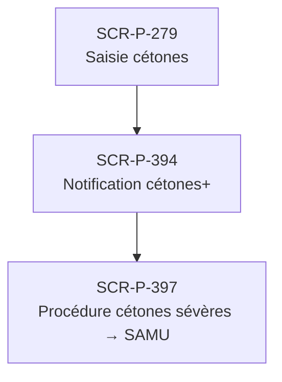

# J-P-04 — Réaction urgence DKA → SAMU

> 🟢 Priorité **MVP** · Persona **Patient T1 critique** · 3 écrans · 69 SP cumulés (×plat)

---

## Séquence d'écrans

1. [SCR-P-279 — Saisie cétones](../by-category/08-journal/SCR-P-279-saisie-cetones.md)
2. [SCR-P-394 — Notification cétones+](../by-category/27-urgences-cetones/SCR-P-394-notification-cetones.md)
3. [SCR-P-397 — Procédure cétones sévères → SAMU](../by-category/27-urgences-cetones/SCR-P-397-procedure-cetones-severes-samu-ios.md)

---

## Représentation flow (Mermaid)

---

## Notes

- Ce parcours doit être validé par un PO produit avant développement
- Tests E2E recommandés sur le parcours complet (1 spec par parcours critique)
- Le SP cumulé tient compte du multiplicateur plateformes (×3 pour 'all', ×2 pour 'mobile')
