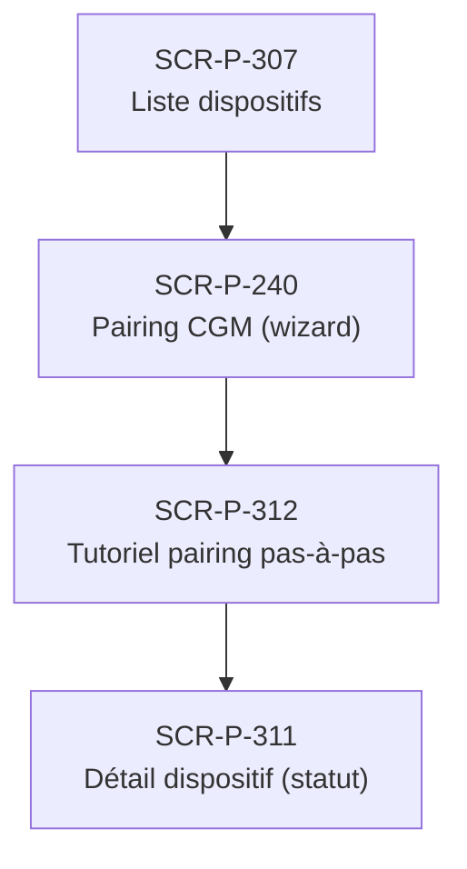

# J-P-05 — Pairing CGM Bluetooth

> 🟢 Priorité **MVP** · Persona **Patient nouveau dispositif** · 4 écrans · 43 SP cumulés (×plat)

---

## Séquence d'écrans

1. [SCR-P-307 — Liste dispositifs](../by-category/12-dispositifs/SCR-P-307-liste-dispositifs.md)
2. [SCR-P-240 — Pairing CGM (wizard)](../by-category/04-glycemie/SCR-P-240-pairing-cgm-wizard-ios.md)
3. [SCR-P-312 — Tutoriel pairing pas-à-pas](../by-category/12-dispositifs/SCR-P-312-tutoriel-pairing-pas-a-pas.md)
4. [SCR-P-311 — Détail dispositif (statut)](../by-category/12-dispositifs/SCR-P-311-detail-dispositif-statut.md)

---

## Représentation flow (Mermaid)

---

## Notes

- Ce parcours doit être validé par un PO produit avant développement
- Tests E2E recommandés sur le parcours complet (1 spec par parcours critique)
- Le SP cumulé tient compte du multiplicateur plateformes (×3 pour 'all', ×2 pour 'mobile')
