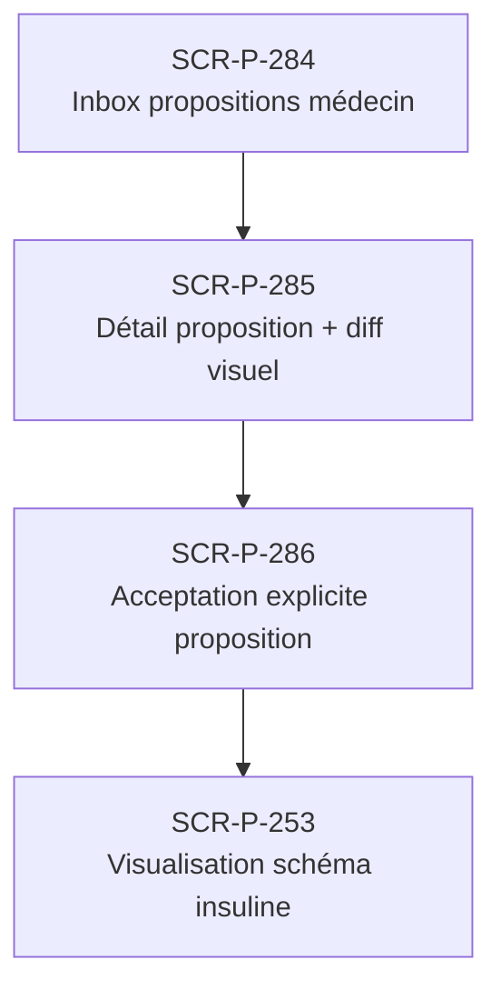

# J-P-06 — Réception et acceptation proposition médecin

> 🟢 Priorité **MVP** · Persona **Patient avec médecin référent** · 4 écrans · 63 SP cumulés (×plat)

---

## Séquence d'écrans

1. [SCR-P-284 — Inbox propositions médecin](../by-category/09-propositions/SCR-P-284-inbox-propositions-medecin.md)
2. [SCR-P-285 — Détail proposition + diff visuel](../by-category/09-propositions/SCR-P-285-detail-proposition-diff-visuel.md)
3. [SCR-P-286 — Acceptation explicite proposition](../by-category/09-propositions/SCR-P-286-acceptation-explicite-proposition.md)
4. [SCR-P-253 — Visualisation schéma insuline](../by-category/05-insuline/SCR-P-253-visualisation-schema-insuline.md)

---

## Représentation flow (Mermaid)

---

## Notes

- Ce parcours doit être validé par un PO produit avant développement
- Tests E2E recommandés sur le parcours complet (1 spec par parcours critique)
- Le SP cumulé tient compte du multiplicateur plateformes (×3 pour 'all', ×2 pour 'mobile')
