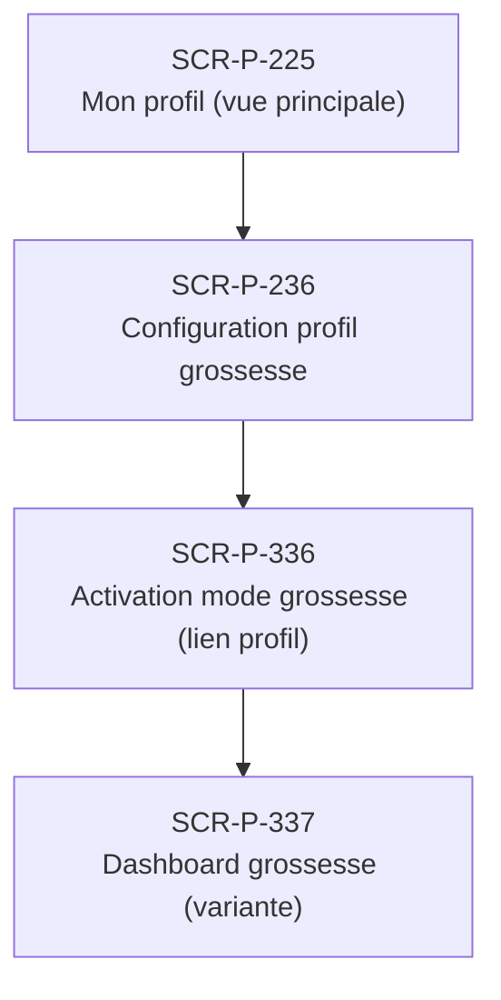

# J-P-07 — Activation mode grossesse

> 🟢 Priorité **MVP** · Persona **Patiente enceinte** · 4 écrans · 69 SP cumulés (×plat)

---

## Séquence d'écrans

1. [SCR-P-225 — Mon profil (vue principale)](../by-category/03-profil/SCR-P-225-mon-profil-vue-principale.md)
2. [SCR-P-236 — Configuration profil grossesse](../by-category/03-profil/SCR-P-236-configuration-profil-grossesse.md)
3. [SCR-P-336 — Activation mode grossesse (lien profil)](../by-category/17-modegrossesse/SCR-P-336-activation-mode-grossesse-lien-profil.md)
4. [SCR-P-337 — Dashboard grossesse (variante)](../by-category/17-modegrossesse/SCR-P-337-dashboard-grossesse-variante.md)

---

## Représentation flow (Mermaid)

---

## Notes

- Ce parcours doit être validé par un PO produit avant développement
- Tests E2E recommandés sur le parcours complet (1 spec par parcours critique)
- Le SP cumulé tient compte du multiplicateur plateformes (×3 pour 'all', ×2 pour 'mobile')
