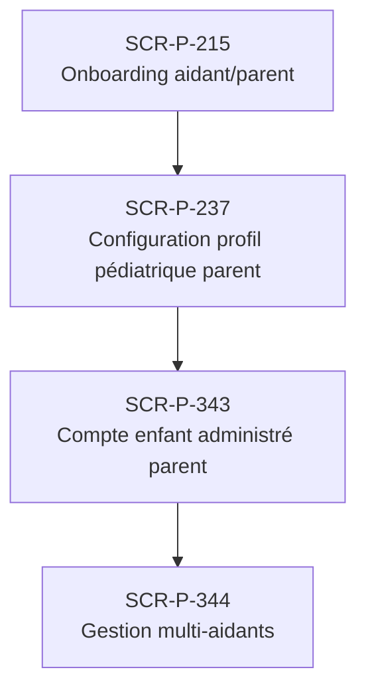

# J-P-08 — Onboarding parent compte enfant

> 🔵 Priorité **V1** · Persona **Parent administrateur** · 4 écrans · 78 SP cumulés (×plat)

---

## Séquence d'écrans

1. [SCR-P-215 — Onboarding aidant/parent](../by-category/01-onboarding/SCR-P-215-onboarding-aidant-parent.md)
2. [SCR-P-237 — Configuration profil pédiatrique parent](../by-category/03-profil/SCR-P-237-configuration-profil-pediatrique-parent.md)
3. [SCR-P-343 — Compte enfant administré parent](../by-category/18-pediatrie/SCR-P-343-compte-enfant-administre-parent.md)
4. [SCR-P-344 — Gestion multi-aidants](../by-category/18-pediatrie/SCR-P-344-gestion-multi-aidants.md)

---

## Représentation flow (Mermaid)

---

## Notes

- Ce parcours doit être validé par un PO produit avant développement
- Tests E2E recommandés sur le parcours complet (1 spec par parcours critique)
- Le SP cumulé tient compte du multiplicateur plateformes (×3 pour 'all', ×2 pour 'mobile')
