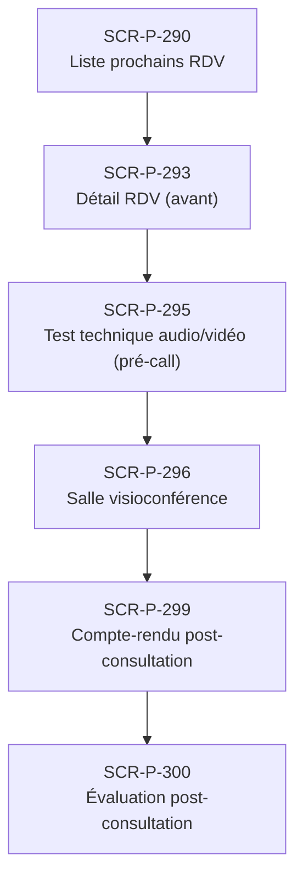

# J-P-09 — Téléconsultation patient (V4)

> 🔴 Priorité **V4** · Persona **Patient + médecin** · 6 écrans · 93 SP cumulés (×plat)

---

## Séquence d'écrans

1. [SCR-P-290 — Liste prochains RDV](../by-category/10-teleconsult/SCR-P-290-liste-prochains-rdv.md)
2. [SCR-P-293 — Détail RDV (avant)](../by-category/10-teleconsult/SCR-P-293-detail-rdv-avant.md)
3. [SCR-P-295 — Test technique audio/vidéo (pré-call)](../by-category/10-teleconsult/SCR-P-295-test-technique-audio-video-pre-call-ios.md)
4. [SCR-P-296 — Salle visioconférence](../by-category/10-teleconsult/SCR-P-296-salle-visioconference-ios.md)
5. [SCR-P-299 — Compte-rendu post-consultation](../by-category/10-teleconsult/SCR-P-299-compte-rendu-post-consultation.md)
6. [SCR-P-300 — Évaluation post-consultation](../by-category/10-teleconsult/SCR-P-300-evaluation-post-consultation.md)

---

## Représentation flow (Mermaid)

---

## Notes

- Ce parcours doit être validé par un PO produit avant développement
- Tests E2E recommandés sur le parcours complet (1 spec par parcours critique)
- Le SP cumulé tient compte du multiplicateur plateformes (×3 pour 'all', ×2 pour 'mobile')
