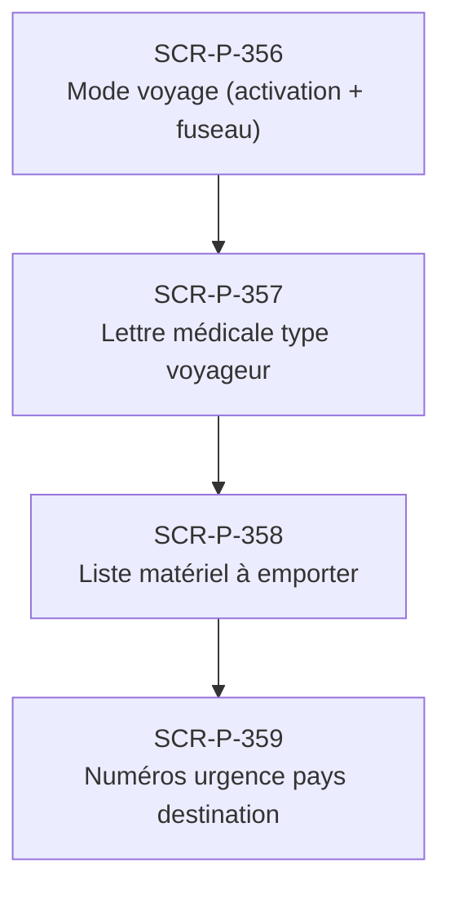

# J-P-10 — Préparation voyage

> 🔵 Priorité **V1** · Persona **Patient voyageur** · 4 écrans · 39 SP cumulés (×plat)

---

## Séquence d'écrans

1. [SCR-P-356 — Mode voyage (activation + fuseau)](../by-category/21-voyages/SCR-P-356-mode-voyage-activation-fuseau.md)
2. [SCR-P-357 — Lettre médicale type voyageur](../by-category/21-voyages/SCR-P-357-lettre-medicale-type-voyageur.md)
3. [SCR-P-358 — Liste matériel à emporter](../by-category/21-voyages/SCR-P-358-liste-materiel-a-emporter.md)
4. [SCR-P-359 — Numéros urgence pays destination](../by-category/21-voyages/SCR-P-359-numeros-urgence-pays-destination.md)

---

## Représentation flow (Mermaid)

---

## Notes

- Ce parcours doit être validé par un PO produit avant développement
- Tests E2E recommandés sur le parcours complet (1 spec par parcours critique)
- Le SP cumulé tient compte du multiplicateur plateformes (×3 pour 'all', ×2 pour 'mobile')
