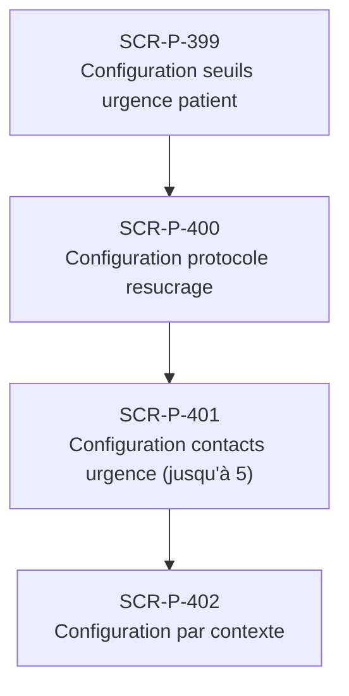

# J-P-11 — Configuration urgence personnalisée

> 🟢 Priorité **MVP** · Persona **Patient + (validation médecin)** · 4 écrans · 60 SP cumulés (×plat)

---

## Séquence d'écrans

1. [SCR-P-399 — Configuration seuils urgence patient](../by-category/27-urgences-personnalisation/SCR-P-399-configuration-seuils-urgence-patient.md)
2. [SCR-P-400 — Configuration protocole resucrage](../by-category/27-urgences-personnalisation/SCR-P-400-configuration-protocole-resucrage.md)
3. [SCR-P-401 — Configuration contacts urgence (jusqu'à 5)](../by-category/27-urgences-personnalisation/SCR-P-401-configuration-contacts-urgence-jusqu-a-5.md)
4. [SCR-P-402 — Configuration par contexte](../by-category/27-urgences-personnalisation/SCR-P-402-configuration-par-contexte.md)

---

## Représentation flow (Mermaid)

---

## Notes

- Ce parcours doit être validé par un PO produit avant développement
- Tests E2E recommandés sur le parcours complet (1 spec par parcours critique)
- Le SP cumulé tient compte du multiplicateur plateformes (×3 pour 'all', ×2 pour 'mobile')
