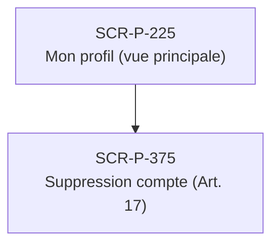

# J-P-13 — Suppression compte Article 17

> 🟢 Priorité **MVP** · Persona **Patient** · 2 écrans · 39 SP cumulés (×plat)

---

## Séquence d'écrans

1. [SCR-P-225 — Mon profil (vue principale)](../by-category/03-profil/SCR-P-225-mon-profil-vue-principale.md)
2. [SCR-P-375 — Suppression compte (Art. 17)](../by-category/24-rgpd/SCR-P-375-suppression-compte-art-17.md)

---

## Représentation flow (Mermaid)

---

## Notes

- Ce parcours doit être validé par un PO produit avant développement
- Tests E2E recommandés sur le parcours complet (1 spec par parcours critique)
- Le SP cumulé tient compte du multiplicateur plateformes (×3 pour 'all', ×2 pour 'mobile')
