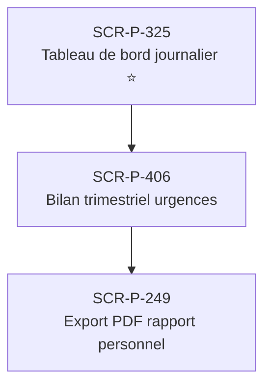

# J-P-14 — Bilan trimestriel + partage médecin

> 🔵 Priorité **V1** · Persona **Patient suivi** · 3 écrans · 69 SP cumulés (×plat)

---

## Séquence d'écrans

1. [SCR-P-325 — Tableau de bord journalier ⭐](../by-category/15-suivi/SCR-P-325-tableau-de-bord-journalier.md)
2. [SCR-P-406 — Bilan trimestriel urgences](../by-category/27-urgences-suivi/SCR-P-406-bilan-trimestriel-urgences.md)
3. [SCR-P-249 — Export PDF rapport personnel](../by-category/04-glycemie/SCR-P-249-export-pdf-rapport-personnel.md)

---

## Représentation flow (Mermaid)

---

## Notes

- Ce parcours doit être validé par un PO produit avant développement
- Tests E2E recommandés sur le parcours complet (1 spec par parcours critique)
- Le SP cumulé tient compte du multiplicateur plateformes (×3 pour 'all', ×2 pour 'mobile')
