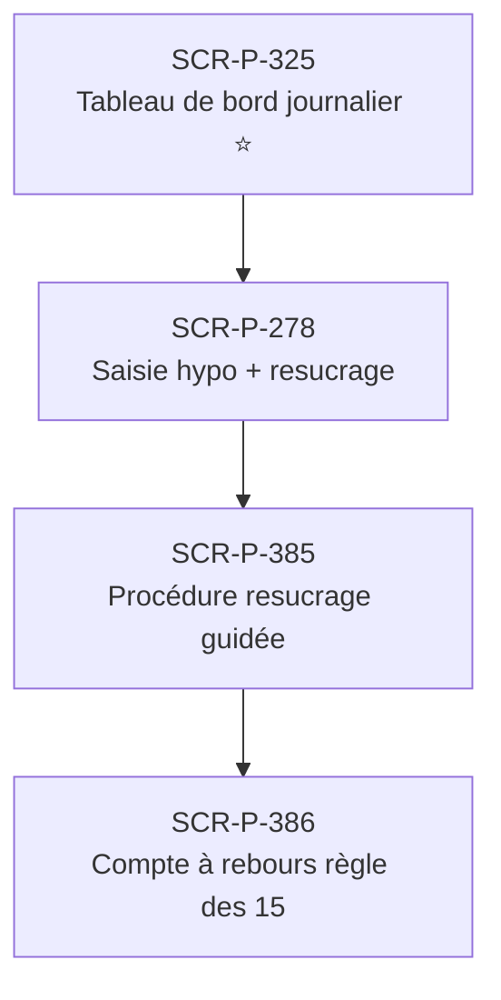

# J-P-15 — Saisie hypo manuelle + correction

> 🟢 Priorité **MVP** · Persona **Patient quotidien** · 4 écrans · 102 SP cumulés (×plat)

---

## Séquence d'écrans

1. [SCR-P-325 — Tableau de bord journalier ⭐](../by-category/15-suivi/SCR-P-325-tableau-de-bord-journalier.md)
2. [SCR-P-278 — Saisie hypo + resucrage](../by-category/08-journal/SCR-P-278-saisie-hypo-resucrage.md)
3. [SCR-P-385 — Procédure resucrage guidée](../by-category/27-urgences-hypo/SCR-P-385-procedure-resucrage-guidee.md)
4. [SCR-P-386 — Compte à rebours règle des 15](../by-category/27-urgences-hypo/SCR-P-386-compte-a-rebours-regle-des-15.md)

---

## Représentation flow (Mermaid)

---

## Notes

- Ce parcours doit être validé par un PO produit avant développement
- Tests E2E recommandés sur le parcours complet (1 spec par parcours critique)
- Le SP cumulé tient compte du multiplicateur plateformes (×3 pour 'all', ×2 pour 'mobile')
