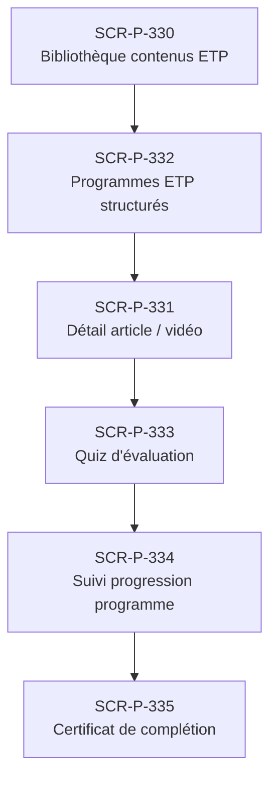

# J-P-16 — Programme ETP prescrit

> 🟠 Priorité **V3** · Persona **Patient + médecin** · 6 écrans · 87 SP cumulés (×plat)

---

## Séquence d'écrans

1. [SCR-P-330 — Bibliothèque contenus ETP](../by-category/16-etp/SCR-P-330-bibliotheque-contenus-etp.md)
2. [SCR-P-332 — Programmes ETP structurés](../by-category/16-etp/SCR-P-332-programmes-etp-structures.md)
3. [SCR-P-331 — Détail article / vidéo](../by-category/16-etp/SCR-P-331-detail-article-video.md)
4. [SCR-P-333 — Quiz d'évaluation](../by-category/16-etp/SCR-P-333-quiz-d-evaluation.md)
5. [SCR-P-334 — Suivi progression programme](../by-category/16-etp/SCR-P-334-suivi-progression-programme.md)
6. [SCR-P-335 — Certificat de complétion](../by-category/16-etp/SCR-P-335-certificat-de-completion.md)

---

## Représentation flow (Mermaid)

---

## Notes

- Ce parcours doit être validé par un PO produit avant développement
- Tests E2E recommandés sur le parcours complet (1 spec par parcours critique)
- Le SP cumulé tient compte du multiplicateur plateformes (×3 pour 'all', ×2 pour 'mobile')
