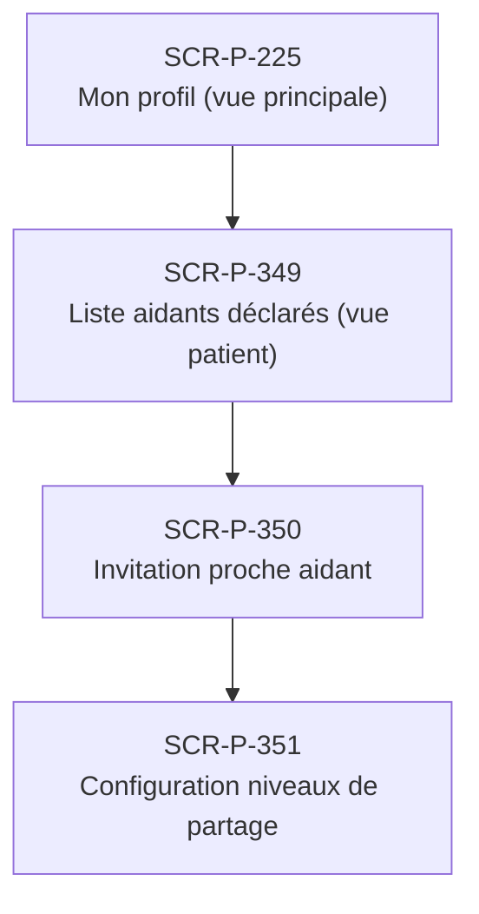

# J-P-17 — Invitation aidant + partage

> 🔵 Priorité **V1** · Persona **Patient** · 4 écrans · 54 SP cumulés (×plat)

---

## Séquence d'écrans

1. [SCR-P-225 — Mon profil (vue principale)](../by-category/03-profil/SCR-P-225-mon-profil-vue-principale.md)
2. [SCR-P-349 — Liste aidants déclarés (vue patient)](../by-category/19-aidants/SCR-P-349-liste-aidants-declares-vue-patient.md)
3. [SCR-P-350 — Invitation proche aidant](../by-category/19-aidants/SCR-P-350-invitation-proche-aidant.md)
4. [SCR-P-351 — Configuration niveaux de partage](../by-category/19-aidants/SCR-P-351-configuration-niveaux-de-partage.md)

---

## Représentation flow (Mermaid)

---

## Notes

- Ce parcours doit être validé par un PO produit avant développement
- Tests E2E recommandés sur le parcours complet (1 spec par parcours critique)
- Le SP cumulé tient compte du multiplicateur plateformes (×3 pour 'all', ×2 pour 'mobile')
