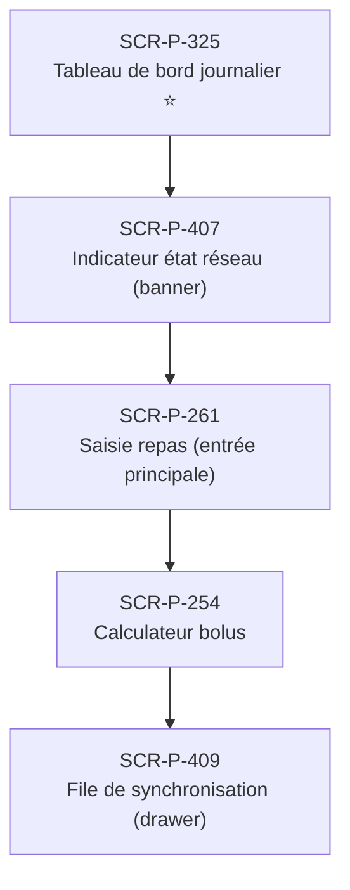

# J-P-19 — Mode hors-ligne (avion / métro)

> 🟢 Priorité **MVP** · Persona **Patient en mobilité** · 5 écrans · 102 SP cumulés (×plat)

---

## Séquence d'écrans

1. [SCR-P-325 — Tableau de bord journalier ⭐](../by-category/15-suivi/SCR-P-325-tableau-de-bord-journalier.md)
2. [SCR-P-407 — Indicateur état réseau (banner)](../by-category/28-offline/SCR-P-407-indicateur-etat-reseau-banner.md)
3. [SCR-P-261 — Saisie repas (entrée principale)](../by-category/06-repas/SCR-P-261-saisie-repas-entree-principale.md)
4. [SCR-P-254 — Calculateur bolus](../by-category/05-insuline/SCR-P-254-calculateur-bolus.md)
5. [SCR-P-409 — File de synchronisation (drawer)](../by-category/28-offline/SCR-P-409-file-de-synchronisation-drawer.md)

---

## Représentation flow (Mermaid)

---

## Notes

- Ce parcours doit être validé par un PO produit avant développement
- Tests E2E recommandés sur le parcours complet (1 spec par parcours critique)
- Le SP cumulé tient compte du multiplicateur plateformes (×3 pour 'all', ×2 pour 'mobile')
