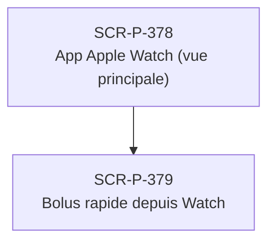

# J-P-20 — Apple Watch — bolus rapide

> 🟡 Priorité **V2** · Persona **Patient Apple Watch** · 2 écrans · 16 SP cumulés (×plat)

---

## Séquence d'écrans

1. [SCR-P-378 — App Apple Watch (vue principale)](../by-category/25-wearables/SCR-P-378-app-apple-watch-vue-principale-ios.md)
2. [SCR-P-379 — Bolus rapide depuis Watch](../by-category/25-wearables/SCR-P-379-bolus-rapide-depuis-watch-ios.md)

---

## Représentation flow (Mermaid)

---

## Notes

- Ce parcours doit être validé par un PO produit avant développement
- Tests E2E recommandés sur le parcours complet (1 spec par parcours critique)
- Le SP cumulé tient compte du multiplicateur plateformes (×3 pour 'all', ×2 pour 'mobile')
