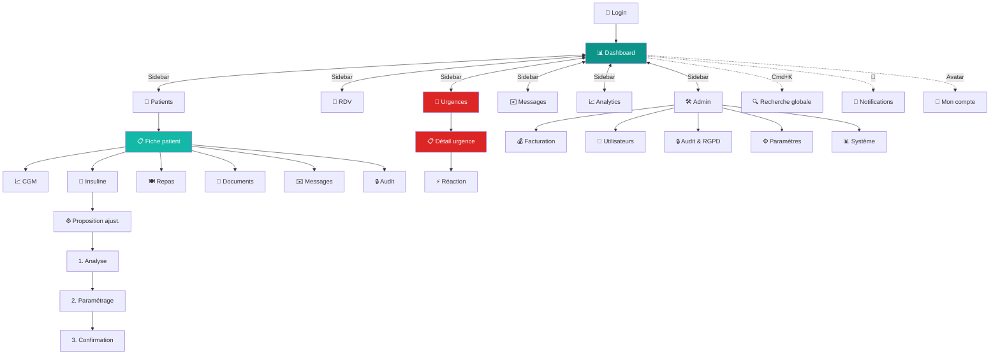
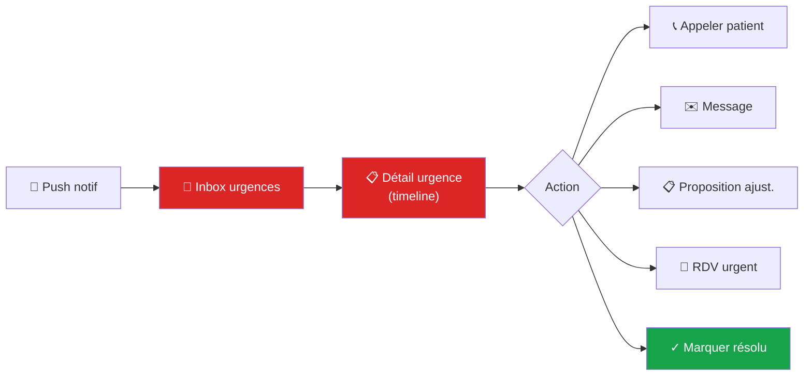
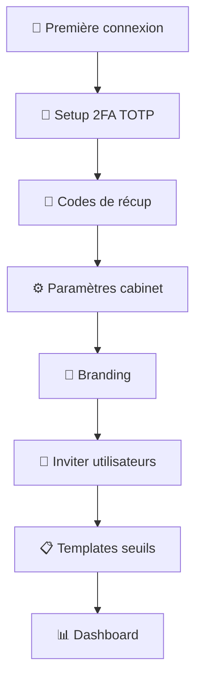

# Diabeo BackOffice — Spécification de navigation

> Spec consolidée de la navigation pour le backoffice professionnel (web only). Couvre l'architecture d'information, les patterns de navigation, les conventions UX, et les variations contextuelles.

**Périmètre** : 185 écrans cartographiés (cf `Diabeo_BackOffice_Ecrans_MD.zip`), 26 catégories fonctionnelles, plateforme web exclusivement.

---

## Sommaire

1. [Architecture d'information](#1-architecture-dinformation)
2. [Layout web responsive](#2-layout-web-responsive)
3. [Navigation principale (sidebar)](#3-navigation-principale)
4. [Top header global](#4-top-header-global)
5. [Navigation secondaire](#5-navigation-secondaire)
6. [Recherche globale et accès rapide](#6-recherche-globale-et-accès-rapide)
7. [Notifications & alertes](#7-notifications--alertes)
8. [Navigation système (back, deep links, raccourcis)](#8-navigation-système)
9. [Conventions UX transverses](#9-conventions-ux-transverses)
10. [Diagrammes de navigation](#10-diagrammes-de-navigation)
11. [Variations par contexte / rôle](#11-variations-par-contexte--rôle)
12. [Cas particuliers et edge cases](#12-cas-particuliers-et-edge-cases)

---

## 1. Architecture d'information

### Principe directeur

Le backoffice Diabeo s'articule autour d'**un workflow médical** : le médecin gère un portefeuille de patients, supervise leurs données glycémiques, propose des ajustements, gère les urgences, et tient ses obligations administratives (facturation, RGPD, audit).

La navigation doit permettre de passer **rapidement d'un patient à l'autre** et **d'une vue clinique à une vue opérationnelle** sans perdre le contexte. La fiche patient est l'écran le plus utilisé : elle doit être atteignable en **1-2 clics maximum** depuis n'importe où.

### 7 sections principales

| # | Section | Rôle | Catégories cartographiées |
|---|---------|------|---------------------------|
| 1 | **Tableau de bord** | Vue synthétique cabinet, urgences, RDV du jour | 03-Dashboard |
| 2 | **Patients** | Liste, recherche, fiche patient (cœur métier) | 04-Patients, 05-FichePatient, 06-AjustementProposition |
| 3 | **Téléconsult & RDV** | Calendrier, RDV, visio (V4), CR | 07-Teleconsult |
| 4 | **Urgences** | Inbox urgences cabinet, monitoring temps réel | 08-Urgences |
| 5 | **Messagerie** | Inbox messages tous patients | 15-Messagerie |
| 6 | **Analytics & rapports** | KPI, indicateurs qualité, cohortes, rapports custom | 16-Analytics |
| 7 | **Administration** | Facturation, gestion users, RGPD, audit, conformité, paramètres cabinet | 17-Facturation, 18-Admin, 19-AuditRgpd, 24-Developer |

### Sections accessibles via raccourcis

- **Recherche globale** : Cmd+K, accessible de partout
- **Notifications** : icône cloche dans header, badge count, drawer
- **Mon compte / Profil utilisateur** : avatar dans header, menu déroulant
- **Aide & support** : icône `?` dans header

### Hiérarchie complète

```
Diabeo BackOffice
├── 📊 Tableau de bord
│   ├── Cards : Urgences en cours, RDV du jour
│   ├── Cards : Patients à suivre
│   ├── KPI cabinet (synthèse)
│   └── Vue rapide notifications
│
├── 👥 Patients
│   ├── Liste patients (table filtrable)
│   ├── Filtres avancés (drawer)
│   ├── Recherche type-ahead
│   ├── Création patient (wizard 5 étapes)
│   ├── Import cohorte (CSV/Excel)
│   ├── Export liste
│   ├── Action en lot
│   └── Fiche patient (sous-arbre)
│       ├── Vue d'ensemble (synthèse 360°)
│       ├── Démographie
│       ├── Antécédents médicaux
│       ├── Glycémie / CGM
│       │   └── Vue AGP plein écran
│       ├── Insulinothérapie
│       │   ├── Schéma actuel
│       │   ├── Editor ratios IC/FS
│       │   └── Workflow proposition (3 étapes)
│       ├── Repas & glucides
│       ├── Activité physique
│       ├── Documents & ordonnances
│       ├── Communication (messages)
│       └── Audit & traçabilité (par patient)
│
├── 📅 Téléconsult & RDV
│   ├── Calendrier RDV cabinet (jour/semaine/mois)
│   ├── Création RDV
│   ├── Détail RDV (modal)
│   ├── Salle visioconférence (V4)
│   └── Compte-rendu post-consultation
│
├── 🚨 Urgences
│   ├── Inbox urgences globale
│   ├── Détail urgence (timeline)
│   ├── Réaction post-urgence (workflow)
│   ├── Bilan trimestriel (par patient — atteignable depuis fiche)
│   ├── Statistiques cohorte urgences
│   └── Détection patients à risque
│
├── ✉️ Messagerie
│   ├── Inbox globale (tous threads)
│   ├── Thread détail (par patient)
│   ├── Templates messages (V2)
│   ├── Messages programmés (V2)
│   └── Diffusion à cohorte (V3)
│
├── 📈 Analytics & rapports
│   ├── Dashboard analytics cabinet
│   ├── Indicateurs qualité (HbA1c, TIR distribution)
│   ├── Cohorte par pathologie
│   ├── Comparaison cabinet vs réseau (V2)
│   ├── Builder rapport custom (V2)
│   ├── Charge soignant (V2)
│   ├── Sync status cohorte (dispositifs)
│   ├── Détection dispositifs défaillants
│   ├── Sous-port capteur
│   └── Activité ETP cabinet (V3)
│
└── 🛠️ Administration (RBAC : ADMIN principalement)
    ├── Facturation
    │   ├── Tableau de bord financier
    │   ├── Liste factures
    │   ├── Détail facture
    │   ├── Création facture
    │   ├── Configuration Stripe (V4)
    │   ├── Relances auto
    │   ├── Refunds
    │   ├── Configuration TVA multi-pays
    │   └── Export comptable (V2)
    ├── Gestion utilisateurs
    │   ├── Liste users cabinet
    │   ├── Création / édition user
    │   └── Branding cabinet (V2)
    ├── Paramètres cabinet
    ├── Templates de seuils (admin)
    ├── Bibliothèque ETP (V2)
    ├── Bibliothèque templates messages (V2)
    ├── API & développeurs (V2)
    │   ├── Documentation API publique
    │   └── Gestion clés API
    ├── Logs applicatifs centralisés
    ├── Dashboard santé système
    ├── Status page (config + publique)
    ├── Backups
    └── RGPD & conformité
        ├── Audit log global
        ├── Détail entrée audit
        ├── Export audit pour certif HDS
        ├── Tableau de bord conformité HDS
        ├── Gestion demandes RGPD patients
        ├── Workflow effacement RGPD
        └── Notifications violation CNIL

Accès transverse (depuis n'importe où) :
├── 🔔 Notifications + alertes
├── 🔍 Recherche globale (Cmd+K)
├── 👤 Mon compte / Préférences
├── ❓ Aide & support
├── 🚨 Bannière urgence patient (si urgence active dans cabinet)
└── 🔄 Indicateur mode dégradé (offline/sync)
```

---

## 2. Layout web responsive

### Breakpoints

| Breakpoint | Cible | Layout |
|------------|-------|--------|
| **≥1440px** | Desktop large (cabinet) | Sidebar fixe + content + panel droit optionnel |
| **1024-1440px** | Desktop standard (cabinet) | Sidebar fixe + content |
| **768-1024px** | Tablette (visite, hôpital) | Sidebar collapsible (icônes) + content |
| **<768px** | Mobile (urgence, mobilité) | Bannière + drawer nav + content (rare en pratique) |

### Cible principale

**1440-1920px** : c'est l'écran type d'un médecin diabétologue en consultation. Le layout doit être **dense en informations** mais lisible, avec possibilité d'afficher courbe glycémique + fiche patient + propositions en parallèle.

### Layout standard (≥1024px)

```
┌──────┬──────────────────────────────────────────────────┐
│      │ [Diabeo]   [🔍 Recherche]  [🔔 3] [❓] [👤 Dr Y]│
│      ├──────────────────────────────────────────────────┤
│      │                                                  │
│ Side │                                                  │
│ Nav  │              CONTENU PRINCIPAL                   │
│      │                                                  │
│      │                                                  │
│      │                                                  │
└──────┴──────────────────────────────────────────────────┘
```

- **Sidebar** : 240px de large, fixe (sticky)
- **Topbar** : 64px de hauteur, sticky
- **Content** : remplit le reste, max-width 1600px centré

### Layout fiche patient (cas particulier)

La fiche patient utilise un **3-pane layout** sur grand écran :

```
┌──────┬──────────────────────────────────────────────────┐
│      │ [Topbar]                                         │
│      ├────────────────┬─────────────────────────────────┤
│      │ Header patient (photo, nom, tabs)                │
│ Side ├────────────────┼─────────────────────────────────┤
│ Nav  │                │                                 │
│      │  Tabs          │   Contenu de l'onglet           │
│      │  fiche         │                                 │
│      │  patient       │                                 │
│      │                │                                 │
└──────┴────────────────┴─────────────────────────────────┘
```

- **Sidebar** principale : navigation cabinet
- **Tabs verticales** dans la fiche patient (sub-nav) : Synthèse, Démographie, Antécédents, Glycémie, Insulinothérapie, Repas, Activité, Documents, Messages, Audit
- **Content** : contenu de l'onglet sélectionné

---

## 3. Navigation principale

### Sidebar — structure complète

```
┌─────────────────────┐
│  📋 Diabeo          │  ← Logo cliquable (retour dashboard)
│  Cabinet Dr Martin  │  ← Nom cabinet + switch si multi-entité
├─────────────────────┤
│ 📊 Tableau de bord  │
│ 👥 Patients         │  
│ 📅 RDV (3)          │  ← Badge si RDV imminent
│ 🚨 Urgences (2)     │  ← Badge rouge si urgence active
│ ✉️ Messages (5)     │  ← Badge si non lu
│ 📈 Analytics        │
├─────────────────────┤
│ 🛠️ Administration   │  ← Section repliée par défaut, RBAC ADMIN
│   💰 Facturation    │
│   👤 Utilisateurs   │
│   🔒 RGPD & Audit   │
│   ⚙️ Paramètres     │
│   📊 Système        │
├─────────────────────┤
│ 🆘 Urgence active   │  ← Apparaît seulement si urgence en cours
│ ❓ Aide             │
│                     │
└─────────────────────┘
```

### Règles de la sidebar

- **Sticky** : reste visible au scroll
- **État actif** : item courant en `--primary-50` background, `--primary-700` text, icône remplie
- **Hover** : background `--neutral-100`
- **Badges** :
  - Numérotés (count items à traiter)
  - Couleur : rouge pour urgences, orange pour à traiter, bleu pour info
  - Disparaissent au tap sur la section (marquage comme vu)
- **Section Administration** : repliable, par défaut repliée, état persisté en localStorage
- **Multi-entité** : si le user appartient à plusieurs cabinets, switcher en haut de la sidebar
- **Collapsible** (768-1024px) : seulement icônes, tooltip au hover, expand au clic du logo

### Conventions

- **Icons** : Lucide-react (cohérent shadcn/ui)
- **Typography** : taille 14px, semi-bold pour items, regular pour sub-items
- **Espacement** : 8px de padding vertical, 16px horizontal
- **Divider** : 1px solid `--neutral-200` entre sections logiques

### États dynamiques

| État | Comportement |
|------|--------------|
| Default | Affichage standard, items cliquables |
| Loading global | Skeleton sur la sidebar (rare, surtout au login) |
| Mode dégradé | Bandeau jaune en haut de la sidebar "Connexion limitée" |
| Mode urgence | Section "🆘 Urgence active" apparaît avec animation pulse |
| RBAC restrictif | Sections non autorisées masquées (pas de "permission denied" visible) |

---

## 4. Top header global

```
┌──────────────────────────────────────────────────────────┐
│ Logo  [Recherche globale...]    [🔔 3] [❓] [👤 Dr Y ▾] │
└──────────────────────────────────────────────────────────┘
```

### Composants

| Élément | Rôle |
|---------|------|
| **Logo Diabeo** | Cliquable, retour au dashboard |
| **Recherche globale** | Cmd+K, type-ahead sur patients/médicaments/écrans |
| **Cloche notifications** | Badge count, ouvre drawer notifications |
| **Aide** | Icône `?`, ouvre menu d'aide |
| **Avatar utilisateur** | Click → menu (Mon profil, Préférences, Sessions, Aide, Déconnexion) |

### Recherche globale (Cmd+K)

Modal qui s'ouvre par-dessus l'écran courant. Type-ahead avec catégories de résultats :

```
┌────────────────────────────────────────────────────┐
│ 🔍 Tapez pour rechercher...                  [Esc] │
├────────────────────────────────────────────────────┤
│ Patients                                           │
│   👤 Marie DURAND — Type 1 — Suivi régulier        │
│   👤 Jean MARTIN — Type 2 — Dernier RDV J-3        │
│                                                    │
│ Actions                                            │
│   ➕ Créer un patient                              │
│   📅 Planifier un RDV                              │
│                                                    │
│ Écrans                                             │
│   📊 Tableau de bord                               │
│   📈 Analytics                                     │
│                                                    │
│ Récents                                            │
│   👤 Sophie BERNARD                                │
│   📋 Proposition #4256                             │
└────────────────────────────────────────────────────┘
```

**Règles** :
- Ouverture en `Cmd/Ctrl+K`, fermeture `Esc`
- Catégorisation des résultats : Patients en premier (le plus fréquent)
- Maximum 5 résultats par catégorie, "Voir tout" si plus
- Recherche sensible aux droits RBAC (un VIEWER ne voit que les patients de son périmètre)
- Section "Récents" toujours présente (dernières recherches du user)

### Drawer notifications

Slide depuis la droite, ~400px de large.

```
┌─────────────────────────────────────────────┐
│ Notifications              [Tout lu] [Esc] │
├─────────────────────────────────────────────┤
│ Filtres : [Toutes] [Urgences] [Messages]   │
├─────────────────────────────────────────────┤
│                                             │
│ 🚨 Hypo sévère détectée                     │
│ Marie DURAND • il y a 5 min                 │
│ [Voir détail]                               │
│                                             │
│ 💬 Nouveau message                          │
│ Jean MARTIN • il y a 1h                     │
│ [Répondre]                                  │
│                                             │
│ 📋 Proposition acceptée                     │
│ Sophie BERNARD • il y a 3h                  │
│                                             │
└─────────────────────────────────────────────┘
```

**Règles** :
- Triées par criticité puis fraîcheur
- Filtres rapides en haut
- Action contextuelle directe (Voir détail, Répondre, etc.)
- Marquer comme lu au tap, ou bouton "Tout lu"
- Lien "Voir toutes" en bas pour accéder à la page complète

### Menu utilisateur (avatar)

Dropdown au clic sur avatar :

```
┌─────────────────────────────┐
│ Dr Yves MARTIN              │
│ Diabétologue                │
│ Cabinet Dr Martin           │
├─────────────────────────────┤
│ 👤 Mon profil               │
│ ⚙️ Préférences              │
│ 🔐 Sécurité & sessions      │
│ 🔄 Changer de cabinet       │
│ ❓ Aide & support           │
├─────────────────────────────┤
│ 🚪 Se déconnecter           │
└─────────────────────────────┘
```

---

## 5. Navigation secondaire

### Tabs dans une page

Utilisés notamment dans la **fiche patient** (10 onglets) :

```
┌──────────────────────────┬─────────────────────────────────┐
│ 📊 Synthèse              │                                 │
│ 👤 Démographie           │                                 │
│ 🏥 Antécédents           │                                 │
│ 📈 Glycémie / CGM        │      Contenu de l'onglet        │
│ 💉 Insulinothérapie      │      sélectionné                │
│ 🍽️ Repas & glucides      │                                 │
│ 🏃 Activité physique     │                                 │
│ 📄 Documents             │                                 │
│ ✉️ Messages              │                                 │
│ 🔒 Audit                 │                                 │
└──────────────────────────┴─────────────────────────────────┘
```

**Règles** :
- Tabs **verticales** dans la fiche patient (préférable à horizontal vu le nombre d'onglets)
- État actif visuellement marqué
- Accessible par clavier (Tab + flèches)
- URL reflète l'onglet actif (`/patients/[id]/cgm` plutôt que paramètre `?tab=cgm`)

### Sub-tabs dans un onglet

Exemple : section Glycémie de la fiche patient :

```
[Live] [7j] [14j] [30j] [90j] [AGP] [Heat-map] [Comparer]
```

**Pattern** : segmented control horizontal en haut du content de l'onglet. Maximum 8 segments, scroll horizontal au-delà (rare).

### Wizards multi-étapes

Utilisés dans :
- Création patient (5 étapes)
- Workflow proposition d'ajustement (3 étapes)
- Génération PAI numérique
- Configuration mode pédiatrique

**Pattern** : stepper en haut avec étape courante visualisée.

```
┌─────────────────────────────────────────────────────────────┐
│  ① Identité ─── ② Médical ─── ③ Traitement ─── ④ Inv. ─── ⑤│
│  ●                                                          │
├─────────────────────────────────────────────────────────────┤
│                                                             │
│   [Contenu de l'étape 1]                                    │
│                                                             │
│                                                             │
│                                                             │
├─────────────────────────────────────────────────────────────┤
│  [< Retour]                              [Suivant >]        │
└─────────────────────────────────────────────────────────────┘
```

**Règles** :
- Étape courante : cercle plein primary
- Étapes futures : cercle vide neutre
- Étapes passées : checkmark vert (cliquables pour revenir)
- Boutons Précédent / Suivant en bas, Annuler en haut à droite
- Sauvegarde brouillon possible avec confirmation (sauf wizard sensible : ajustement)

### Breadcrumbs

Utilisés sur les écrans à profondeur ≥ 3 :

```
Tableau de bord > Patients > Marie DURAND > Glycémie / CGM > AGP report
```

**Règles** :
- Cliquables pour revenir à n'importe quel niveau
- Tronqués si trop longs (ellipsis sur les niveaux intermédiaires)
- Présents sur les pages, absents des modals

### Drawers (panneaux latéraux glissants)

Utilisés pour :
- Filtres avancés patients (drawer gauche)
- Notifications (drawer droite)
- Coordination multi-soignants (drawer droite, dans fiche patient)

**Règles** :
- Slide depuis la droite (notifications, annotations)
- Slide depuis la gauche (filtres) — alternative : slide droite aussi par cohérence (à arbitrer en design)
- Largeur ~400px
- Backdrop semi-transparent qui ferme au clic
- Esc ferme aussi
- Le contenu derrière reste visible et lisible (pour fiche patient + drawer annotations)

### Modals

Utilisées pour :
- Créations courtes (RDV, message, validation)
- Confirmations d'actions (suppression, refund, deletion RGPD)
- Édition de configurations (seuils, contacts)

**Règles** :
- Centrées, max-width 600-800px selon contenu
- Backdrop semi-transparent obligatoire
- Esc ferme (sauf modals critiques type confirmation RGPD : explicite)
- Bouton X en haut à droite + boutons en bas
- Modales empilables avec gestion focus

---

## 6. Recherche globale et accès rapide

### Cmd+K — Recherche globale

Voir [section 4](#4-top-header-global) pour le détail.

### Recherche dans une page

Beaucoup de pages ont leur propre barre de recherche en haut du contenu :

- Liste patients : recherche par nom/INS/date naissance
- Inbox messagerie : recherche dans les threads
- Audit log : recherche full-text + filtres
- Documents : recherche par titre/catégorie/date

**Pattern** : input avec icône loupe à gauche, debounce 300ms, résultats filtrés en live.

### Raccourcis clavier globaux

| Raccourci | Action |
|-----------|--------|
| `Cmd/Ctrl+K` | Recherche globale |
| `Cmd/Ctrl+/` | Aide / liste raccourcis |
| `Cmd/Ctrl+B` | Toggle sidebar collapsed |
| `Esc` | Fermer modal / drawer / dropdown |
| `Tab` / `Shift+Tab` | Navigation focus |
| `1` à `7` | Switch section principale |
| `G P` | Goto Patients (style Vim, pour power users) |
| `G D` | Goto Dashboard |
| `G U` | Goto Urgences |
| `?` | Liste des raccourcis |

### Favoris / patients épinglés (V2)

Optionnel, à valider en V2 : permettre au médecin d'épingler 3-5 patients fréquents pour accès rapide depuis la sidebar.

---

## 7. Notifications & alertes

### Sources de notifications

| Source | Type | Criticité |
|--------|------|-----------|
| Urgence patient (hypo sévère, DKA) | Push + drawer + bannière | Critique |
| Nouveau message patient | Drawer + badge | Standard |
| Proposition acceptée par patient | Drawer + badge | Info |
| Demande RGPD nouvelle | Drawer + badge | Action requise |
| Facture impayée échue | Drawer + badge | Action requise |
| Maintenance programmée | Bannière | Info |
| Erreur synchronisation cabinet | Bannière | Warning |

### Bannières globales

| Bannière | Couleur | Persistance |
|----------|---------|-------------|
| Urgence patient active | Rouge `--danger-500` | Tant qu'urgence non résolue |
| Mode dégradé / sync | Orange `--warning-500` | Tant que dégradé |
| Maintenance programmée | Bleu `--info-500` | 24h avant + pendant |
| Conformité (audit dû) | Jaune `--warning-300` | Tant que pas réalisé |

### Notifications push (V2)

Notifications navigateur via Web Push API pour les utilisateurs ayant activé. Surtout pour les urgences patients lorsque le médecin est sur un autre onglet.

**Limite** : Web Push n'est pas équivalent à Critical Alerts iOS — pour les alertes vitales 24/7, le médecin doit avoir l'app patient (ou un canal mobile dédié si développé en V3+).

---

## 8. Navigation système

### Back navigation

Le navigateur web fournit nativement back/forward. Le backoffice doit donc :

- **Utiliser `history.pushState`** correctement pour que back fonctionne
- **Ne pas casser le back** sur les modals : les modals importantes (création patient, workflow ajustement) sont des entrées d'historique
- **Gérer le focus** au retour : remettre le focus sur l'élément qui a déclenché la navigation
- **Avertir avant perte** : si saisie en cours non sauvegardée, modal "Voulez-vous quitter ?"

### Deep links

URLs propres et partageables (entre médecins du cabinet, ou pour bookmarks) :

| URL | Cible |
|-----|-------|
| `/dashboard` | Tableau de bord |
| `/patients` | Liste patients |
| `/patients/[id]` | Fiche patient (synthèse) |
| `/patients/[id]/cgm` | Onglet glycémie de la fiche |
| `/patients/[id]/proposals/new` | Wizard nouvelle proposition |
| `/emergencies/[id]` | Détail urgence |
| `/calendar` | Calendrier RDV |
| `/messages/[patientId]` | Thread messagerie patient |
| `/admin/audit-logs` | Audit log global |
| `/analytics/quality` | Indicateurs qualité |

**Règles** :
- Tous les deep links **vérifient l'authentification** + RBAC
- Si non authentifié → redirige login en gardant l'intent
- Si non autorisé (RBAC) → redirige avec message clair "Accès refusé"
- Si patient non dans le périmètre → redirige avec message générique

### Bookmarks

Les médecins doivent pouvoir bookmarker une URL et y revenir directement (avec authentification).

### Onglets multiples

Un médecin peut avoir plusieurs onglets ouverts en parallèle (fréquent pendant la consultation : fiche patient + analytics + calendrier).

**Règles** :
- Synchronisation cross-tabs des sessions (déconnexion d'un onglet déconnecte les autres)
- Synchronisation des notifications (badge count cohérent)
- Sync des données récentes via storage events ou WebSocket

### Sessions multiples / déconnexion

- Verrouillage automatique après 15 min d'inactivité (configurable cabinet)
- Re-authentification simple (mdp ou biométrie via WebAuthn) sans recharger la page
- Liste des sessions actives consultable, révocation à distance possible

---

## 9. Conventions UX transverses

### États globaux

| État | Affichage | Comportement |
|------|-----------|--------------|
| **Online + sync OK** | Aucune bannière | Default |
| **Synchronisation en cours** | Petite icône animée header | Disparaît à fin |
| **Offline** | Bannière jaune | Mode dégradé, indication des fonctions limitées |
| **Maintenance programmée** | Bannière bleue | 24h avant |
| **Urgence patient active** | Bannière rouge persistante + count sidebar | Jusqu'à résolution |
| **Service externe down** (Stripe, FCM) | Bannière orange | Avec workaround si possible |

### Transitions et animations

- Pas d'animation entre routes (changement de section sidebar) : crossfade rapide ou aucune
- **Modals** : fade + scale 200ms
- **Drawers** : slide 300ms ease-out
- **Tabs** : crossfade 150ms
- **Tableau de chargement** : skeleton loaders, pas de spinners
- Réduit les animations si **`prefers-reduced-motion`**

### Loading states

- **Tables** : skeleton avec lignes/colonnes attendues
- **Charts** : spinner centré (skeletons moins pertinents pour graphes)
- **Optimistic UI** sur les actions courantes (annoter, marquer lu) avec rollback si erreur
- **Lazy loading** des onglets de la fiche patient (les onglets non actifs ne sont chargés qu'au clic)

### Empty states pédagogiques

Toujours avec une action proposée :

- **Liste patients vide** : "Aucun patient encore. Commencez par en créer un." + CTA "Nouveau patient"
- **Inbox urgences vide** : "Aucune urgence en cours. Vos patients sont stables." (avec icône rassurante)
- **Pas de messages** : "Pas de conversation. Lancez-en une depuis une fiche patient."

### Responsive

Le backoffice cible le **desktop**. La version responsive mobile est minimaliste :

- **<768px** : page d'accueil minimale "Pour une expérience optimale, utilisez Diabeo sur ordinateur" + accès basique aux urgences cabinet (pour le cas où le médecin est en mobilité)
- **768-1024px** : sidebar collapsée, layouts compacts, certaines fonctions désactivées (analytics complexes)
- **≥1024px** : layout complet

### Internationalisation (FR / AR)

- Français par défaut, arabe optionnel pour Algérie
- **RTL automatique** pour arabe :
  - Sidebar passe à droite
  - Icônes directionnelles miroir
  - Textes alignés à droite
  - Order des colonnes de tables inversé pour les colonnes ordinales
- Format dates et heures locaux

### Accessibilité

- **WCAG 2.1 AA** + **RGAA 4.1** obligatoires (services en santé France)
- Tous les éléments interactifs accessibles au clavier
- Focus visible obligatoire (outline ou border)
- ARIA labels sur tous les boutons icônes
- Tableaux avec headers correctement associés
- Annonces screen reader sur changements importants (notifications, urgences)
- Cibles tactiles minimum 44×44pt

---

## 10. Diagrammes de navigation

### Carte globale du backoffice



### Workflow proposition d'ajustement (chemin critique)

```mermaid
graph LR
    Patient["👤 Fiche patient"] --> Insulin["💉 Tab Insuline"]
    Insulin --> NewProp["➕ Nouvelle proposition"]
    NewProp --> Step1["1️⃣ Analyse données"]
    Step1 --> Step2["2️⃣ Paramétrage<br/>(IC/FS/basale)"]
    Step2 --> Validation["✓ Validation bornes"]
    Validation -->|OK| Step3["3️⃣ Confirmation<br/>+ justification"]
    Validation -->|KO| Step2
    Step3 --> Sign["✍️ Signature"]
    Sign --> Audit["🔒 Audit log"]
    Audit --> Send["📤 Envoi patient"]
    Send --> List["📋 Liste propositions"]
    
    style Step3 fill:#0D9488,color:#fff
    style Audit fill:#fbbf24
```



### Flow réaction urgence patient



### Onboarding cabinet (premier setup)



---

## 11. Variations par contexte / rôle

### Variations par rôle RBAC

Le backoffice a 4 rôles : DOCTOR, NURSE, VIEWER, ADMIN. La navigation s'adapte :

| Section | DOCTOR | NURSE | VIEWER | ADMIN |
|---------|:------:|:-----:|:------:|:-----:|
| Dashboard | ✅ | ✅ | ✅ | ✅ |
| Patients (liste + fiche) | ✅ | ✅ lecture+saisie limitée | ✅ lecture | ✅ |
| Création patient | ✅ | ⚠️ avec validation DOCTOR | ❌ | ✅ |
| Wizard proposition | ✅ | ❌ | ❌ | ❌ |
| Validation proposition NURSE | ✅ | ❌ | ❌ | ❌ |
| Téléconsult | ✅ | ✅ assistante | ❌ | ❌ |
| Inbox urgences | ✅ ses patients | ✅ ses patients | ✅ lecture | ✅ tout |
| Messagerie | ✅ | ✅ | ❌ | ✅ tout |
| Analytics | ✅ son périmètre | ⚠️ limité | ⚠️ limité | ✅ tout |
| Facturation | ⚠️ sa pratique | ❌ | ❌ | ✅ |
| Gestion users | ❌ | ❌ | ❌ | ✅ |
| Audit log | ⚠️ ses actions | ⚠️ ses actions | ❌ | ✅ tout |
| Paramètres cabinet | ❌ | ❌ | ❌ | ✅ |
| API & développeurs | ❌ | ❌ | ❌ | ✅ |

**Règles RBAC** :
- Les sections non autorisées sont **masquées** dans la sidebar (pas de "permission denied" visible)
- Les actions non autorisées sont **désactivées** avec tooltip explicatif
- Les boutons d'action sont conditionnés via le composant `<RbacGate>` (HOC)
- Le menu Administration n'apparaît dans la sidebar que si le user a au moins un rôle ADMIN

### Variations par contexte cabinet

#### Cabinet multi-entité (médecin appartenant à plusieurs cabinets)

- Switcher de cabinet en haut de la sidebar
- Au switch, rechargement complet du contexte (patients, RDV, etc.)
- Audit log spécifique : le switch est tracé

#### Cabinet en mode urgence (urgence active sur un patient)

- Sidebar : section "🆘 Urgence active" apparaît avec animation pulse
- Bannière rouge en haut de l'écran avec lien vers la procédure
- Notifications priorisées : urgence en haut

#### Cabinet en mode dégradé (sync, ANS down, etc.)

- Bannière orange en haut
- Sections impactées masquées ou avec indicateur
- Saisies critiques (urgences, propositions) toujours possibles avec sync différée

### Variations par taille du cabinet

#### Cabinet solo (1 médecin)

- Sidebar simplifiée (pas de switch user, pas de filtre médecin sur les listes)
- Charge soignant peu pertinent → caché ou désactivé
- Calendrier RDV par défaut sur "moi"

#### Cabinet large (10+ utilisateurs, plusieurs médecins)

- Filtres par médecin référent partout (liste patients, RDV, urgences, analytics)
- Vue "tous médecins" par défaut sur le dashboard
- Coordination multi-soignants plus visible
- Charge soignant comme indicateur clé

---

## 12. Cas particuliers et edge cases

### Première connexion (cabinet ou nouvel utilisateur)

- Forcer setup 2FA
- Forcer définition mdp si reset par admin
- Tour guidé interactif (5-7 étapes max)
- Tour réactivable depuis Aide

### Multi-onglets

- Synchronisation des sessions
- Synchronisation des notifications (badge count cohérent)
- Évite les conflits de saisie : si 2 onglets éditent la même fiche patient, dernier sauvé gagne avec warning

### Sessions concurrentes (médecin se connecte sur 2 PC)

- Liste des sessions actives consultable
- Possibilité de révoquer une session à distance
- Pas de blocage par défaut (médecin peut être au cabinet et chez lui)

### Session expirée pendant saisie

- Modal de re-authentification au-dessus de la saisie
- Pas de perte des données saisies (state local conservé)
- Reprise après auth

### Erreur réseau pendant action critique

- Saisie de proposition d'ajustement, RGPD effacement, etc. : mode optimiste **désactivé**
- Spinner explicite pendant l'attente
- Si timeout : message clair avec bouton "Réessayer"
- Sauvegarde brouillon automatique pour ne pas perdre la saisie

### Mode lecture seule (VIEWER)

- Tous les boutons d'action désactivés ou masqués
- Tooltip "Mode consultation uniquement"
- Pas de FAB ou actions rapides

### Plusieurs urgences simultanées dans le cabinet

- Inbox urgences priorise par criticité puis fraîcheur
- Bannière mentionne le nombre : "🚨 3 urgences en cours"
- Notifications groupées dans le drawer

### Performance

- Première vue dashboard : LCP < 2s
- Liste patients (100 lignes) : rendu < 500ms avec virtualisation
- Switch entre onglets fiche patient : < 200ms grâce au lazy loading

### Hors-ligne

Le backoffice étant un outil professionnel utilisé majoritairement en environnement câblé fiable, le mode hors-ligne complet n'est **pas une priorité MVP**. Mais :

- Service Worker de base pour cache des assets
- Indicateur "Connexion perdue" si offline
- Lecture en cache des dernières fiches patient consultées (réutilisation de données)
- Saisies en attente : queue locale, sync à reconnexion

### Internationalisation et multi-cabinet (FR/DZ)

- Préférences cabinet (langue par défaut, devise, fuseau)
- Préférences utilisateur surchargent le cabinet
- AR + RTL pour DZ (sidebar à droite, etc.)

---

## Annexes

### Glossaire des composants de navigation

| Composant | Description |
|-----------|-------------|
| **AppShell** | Layout racine (topbar + sidebar + content) |
| **SideNav** | Sidebar latérale avec sections principales |
| **TopBar** | Barre supérieure (logo, recherche, notifs, avatar) |
| **CommandPalette** | Recherche globale Cmd+K |
| **NotificationCenter** | Drawer notifications (droite) |
| **PatientFilterDrawer** | Drawer filtres avancés (gauche ou droite) |
| **AnnotationsDrawer** | Drawer annotations multi-soignants (droite) |
| **UserMenu** | Menu utilisateur (avatar dropdown) |
| **Breadcrumbs** | Fil d'Ariane sur pages profondes |
| **EmergencyBanner** | Bannière rouge urgence active |
| **OfflineBanner** | Bannière jaune mode dégradé |
| **MaintenanceBanner** | Bannière bleue maintenance programmée |
| **WizardStepper** | Stepper pour wizards multi-étapes |
| **TabsVertical** | Tabs verticales (fiche patient) |
| **TabsHorizontal** | Tabs horizontales (sub-tabs) |
| **CabinetSwitcher** | Switcher multi-entité (haut sidebar) |
| **RbacGate** | HOC qui masque/désactive selon rôle |

### Mapping écrans cartographie ↔ sections nav

| Section sidebar | Catégories cartographie |
|-----------------|------------------------|
| 📊 Tableau de bord | 03-Dashboard |
| 👥 Patients | 04-Patients, 05-FichePatient, 06-AjustementProposition, 09-ConfigSeuils, 10-ModesContextuels, 11-AidantsPartages, 12-Dispositifs, 13-RepasAdhesion |
| 📅 RDV | 07-Teleconsult |
| 🚨 Urgences | 08-Urgences |
| ✉️ Messages | 15-Messagerie |
| 📈 Analytics | 16-Analytics |
| 🛠️ Admin > Facturation | 17-Facturation |
| 🛠️ Admin > Utilisateurs | 18-Admin (gestion users, branding, paramètres cabinet) |
| 🛠️ Admin > Système | 18-Admin (santé, backups, status, logs) |
| 🛠️ Admin > RGPD/Audit | 19-AuditRgpd |
| 🛠️ Admin > Programmes ETP | 14-ETP |
| 🛠️ Admin > Documents (templates) | 20-Documents |
| 🛠️ Admin > API | 24-Developer |
| Transverse | 02-Layout, 21-AideSupport, 22-Profil, 23-Recherche, 25-System, 26-Composants |

### Liens utiles

- **Cartographie écrans** : `Diabeo_BackOffice_Ecrans_MD.zip` (185 écrans détaillés)
- **User stories backoffice** : `Diabeo_UserStories_US2000.zip` (213 US)
- **User stories miroir patient** : `Diabeo_BackOffice_PatientManagement_US2214.zip` (51 US)
- **Inventaire fonctionnel** : `Diabeo_Inventaire_Fonctionnalites.xlsx`
- **Spec navigation patient** : `navigation-patient.md`

---

*Document généré comme spec de navigation pour Diabeo BackOffice. À affiner avec un PO produit et un UX designer pour validation des choix structurants (notamment regroupement des sous-sections Administration, conventions de drawer gauche vs droite, gestion fine du multi-onglets).*
