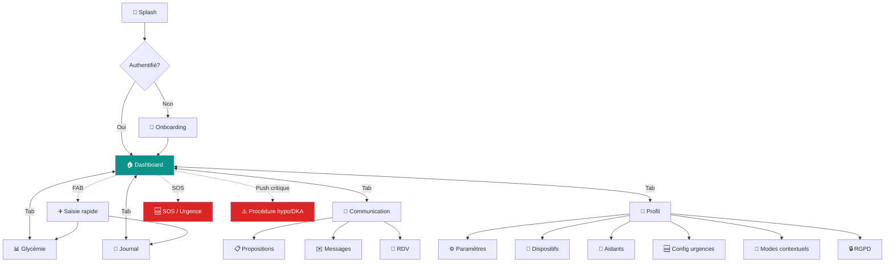
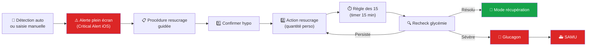
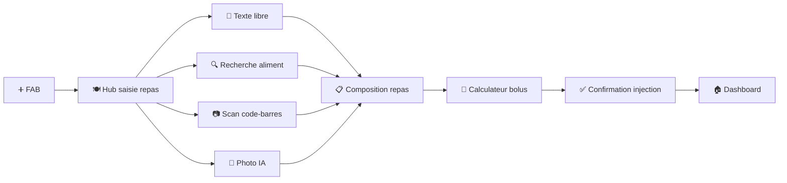
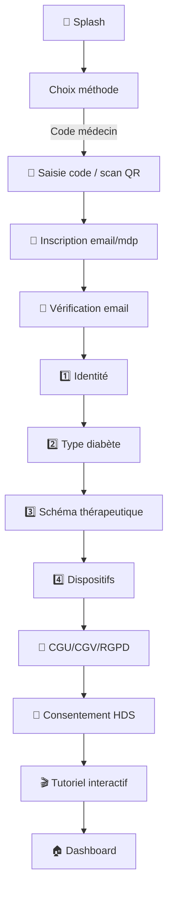

# Diabeo App Patient — Spécification de navigation

> Spec consolidée de la navigation pour l'app patient sur 3 plateformes (iOS, Android, Web). Couvre l'architecture d'information, les patterns de navigation, les conventions UX, et les variations par mode contextuel.

**Périmètre** : 242 écrans logiques cartographiés (cf `Diabeo_AppPatient_Ecrans_MD.zip`), 30 domaines fonctionnels, 3 plateformes.

---

## Sommaire

1. [Architecture d'information](#1-architecture-dinformation)
2. [Patterns de navigation par plateforme](#2-patterns-de-navigation-par-plateforme)
3. [Navigation principale (bottom nav / sidebar)](#3-navigation-principale)
4. [Navigation secondaire (onglets, sub-menus)](#4-navigation-secondaire)
5. [Navigation contextuelle (FAB, raccourcis, gestes)](#5-navigation-contextuelle)
6. [Navigation système (back, gestes, deep links)](#6-navigation-système)
7. [Conventions UX transverses](#7-conventions-ux-transverses)
8. [Diagrammes de navigation](#8-diagrammes-de-navigation)
9. [Variations par mode contextuel](#9-variations-par-mode-contextuel)
10. [Cas particuliers et edge cases](#10-cas-particuliers-et-edge-cases)

---

## 1. Architecture d'information

### Principe directeur

L'app patient Diabeo s'articule autour d'**un seul concept central** : le **suivi quotidien du diabète**. La navigation doit refléter cette priorité. Tout écran doit être à **2 taps maximum** depuis le dashboard pour les actions critiques (saisie glycémie, calcul bolus, déclenchement urgence).

### 5 sections principales

L'app est structurée en 5 sections principales accessibles depuis la navigation primaire :

| # | Section | Rôle | Domaines couverts |
|---|---------|------|-------------------|
| 1 | **Accueil** (dashboard) | Vue synthétique du jour, accès rapide actions fréquentes | 15. Suivi (dashboard), 27. Procédures urgence, 28. Hors-ligne |
| 2 | **Glycémie** | Toutes les données et analyses glycémiques | 4. Glycémie & CGM |
| 3 | **Journal** | Vue chronologique repas/bolus/événements/activité | 6. Repas, 7. Activité, 8. Journal, 5. Insuline (historique) |
| 4 | **Communication** | Médecin, propositions, RDV, messagerie | 9. Propositions, 10. Téléconsult, 11. Messagerie |
| 5 | **Profil & paramètres** | Identité, dispositifs, configurations, RGPD | 1. Onboarding (post-init), 2. Auth, 3. Profil, 12. Dispositifs, 13. Documents, 14. Pharmacie, 16-30 (config & paramètres) |

### Sections accessibles via raccourcis (pas dans nav principale)

- **Notifications & inbox propositions** : icône cloche dans le header, accessible de partout
- **SOS** : FAB rouge persistant, accessible depuis tous les écrans
- **Recherche** : icône loupe dans le header (web), Cmd+K (web), pull-to-search (mobile)

### Hiérarchie complète

```
Diabeo App Patient
├── Accueil (Dashboard)                              [section 1]
│   ├── Cards glycémie / repas / bolus
│   ├── Bilans (hebdo, mensuel, trimestriel urgences)
│   └── Alertes en cours
│
├── Glycémie                                         [section 2]
│   ├── Live (vue temps réel)
│   ├── Tendances (7j/14j/30j/90j)
│   ├── AGP report
│   ├── Heat-map
│   └── Comparaison de périodes
│
├── Journal                                          [section 3]
│   ├── Vue chronologique unifiée
│   ├── Filtres & recherche
│   ├── Saisies (modals via FAB)
│   │   ├── Glycémie manuelle
│   │   ├── Repas (texte / scan / photo IA)
│   │   ├── Bolus (calculateur)
│   │   ├── Insuline lente
│   │   ├── Activité
│   │   └── Événement / hypo / cétones
│   └── Historiques (repas, bolus, activités séparés)
│
├── Communication                                    [section 4]
│   ├── Inbox propositions médecin (badge non lu)
│   ├── Messagerie (threads)
│   ├── RDV (calendrier + liste)
│   └── Documents partagés (ordo, examens, CR)
│
├── Profil & paramètres                              [section 5]
│   ├── Mon profil (identité, médical, traitement)
│   ├── Sécurité (mdp, biométrie, 2FA, sessions)
│   ├── Dispositifs (liste, pairing, statut)
│   ├── Aidants & partages
│   ├── Préférences (unités, langue, thème, notifs)
│   ├── Configurations urgence (seuils, contacts, protocoles)
│   ├── Mode contextuel (grossesse, pédiatrie, Ramadan, voyage)
│   ├── ETP / Apprentissage
│   ├── Aide & support
│   └── RGPD (consentements, export, suppression)
│
└── Accès transverse (depuis n'importe quel écran)
    ├── 🔔 Notifications + Inbox propositions
    ├── 🆘 Bouton SOS (FAB rouge)
    ├── 🔍 Recherche globale (web)
    └── ⚠️ Bannière mode dégradé (offline / sync)
```

---

## 2. Patterns de navigation par plateforme

### iOS

**Pattern principal** : `TabView` SwiftUI avec 5 tabs en bottom bar

- Navigation hiérarchique via `NavigationStack` (iOS 16+) à l'intérieur de chaque tab
- Modals présentés en `sheet` ou `fullScreenCover` selon importance
- Gestes natifs : swipe right pour back, swipe down pour fermer modal
- **Live Activities** pour glycémie en cours et procédure d'urgence active
- **Lock Screen widgets** : glycémie temps réel, accès rapide bolus
- **Apple Watch companion** : complication glycémie, bolus rapide

### Android

**Pattern principal** : `BottomNavigationView` Material 3 avec 5 destinations

- Navigation via `NavHost` Jetpack Compose
- Single-Activity architecture, fragments dépréciés
- Gestes Material : back gesture (predictive back Android 14+), swipe vertical pour modals
- **Glance widgets** pour glycémie temps réel
- **Wear OS tile** pour glycémie au poignet
- Support **Material You** (Dynamic Color) avec fallback palette Diabeo

### Web

**Pattern principal** : Layout responsive

- **≥1024px (desktop)** : Sidebar latérale fixe (5 sections) + topbar (logo, recherche, notifications, avatar)
- **768-1024px (tablette)** : Sidebar collapsible (icônes seulement par défaut, expand au hover)
- **<768px (mobile responsive)** : Bannière en haut "Pour une meilleure expérience, utilisez notre app mobile" + deeplink store. Si le user persiste : bottom nav comme mobile (PWA mode)
- Raccourcis clavier : `Cmd/Ctrl+K` (recherche), `Cmd/Ctrl+/` (aide), gestion focus order pour clavier

### Tableau comparatif des patterns

| Capacité | iOS | Android | Web ≥1024px | Web mobile |
|----------|:---:|:-------:|:-----------:|:----------:|
| Bottom nav 5 tabs | ✅ TabView | ✅ BottomNav M3 | ❌ | ✅ |
| Sidebar latérale | ❌ | ❌ | ✅ Fixe | ❌ |
| FAB central | ✅ | ✅ Material FAB | ⚠️ Optionnel | ✅ |
| Lock screen widget | ✅ WidgetKit | ✅ Glance | ❌ | ❌ |
| Watch companion | ✅ Apple Watch | ✅ Wear OS | ❌ | ❌ |
| Recherche globale | Tab dédié ou pull | Tab dédié ou icône | ✅ Cmd+K | ✅ Icône |
| Deep links | Universal Links | App Links | URL | URL |
| Gestes back | Swipe right | Predictive back | Boutons + Alt+← | Swipe right |

---

## 3. Navigation principale

### Bottom navigation mobile (iOS + Android)

```
┌────────────────────────────────────────────────────────┐
│                                                        │
│                  CONTENU ÉCRAN                         │
│                                                        │
│                                                        │
└────────────────────────────────────────────────────────┘
┌──────┬──────┬──────┬──────┬──────┐
│ 🏠   │ 📊   │  ➕   │ 💬   │ 👤   │
│Accueil│Glyc.│ FAB  │Comm. │Profil│
└──────┴──────┴──────┴──────┴──────┘
                ↑
          FAB central
        (saisie rapide)
```

**Règles :**

- 5 tabs maximum (au-delà, l'utilisateur perd le repère)
- Le **FAB central** est positionné comme une 5ème tab visuelle mais c'est un bouton d'action, pas une destination de navigation. Il ouvre un menu rapide d'actions (saisie glycémie / repas / bolus / événement).
- L'absence du FAB sur l'écran "Journal" est une option : le FAB peut rester partout pour cohérence, ou ne pas apparaître quand on est déjà dans le contexte de saisie. **Choix recommandé : FAB partout sauf en mode urgence active**.
- Badges sur tab "Communication" pour propositions non lues (rouge si urgent)
- Icônes : utiliser SF Symbols (iOS) / Material Symbols (Android) avec labels textuels

### Sidebar web (≥1024px)

```
┌───────────────┬─────────────────────────────────────────┐
│  Diabeo logo  │ [Recherche]   [🔔 3]  [👤 Marie]        │
├───────────────┼─────────────────────────────────────────┤
│               │                                         │
│ 🏠 Accueil    │                                         │
│ 📊 Glycémie   │                                         │
│ 📔 Journal    │           CONTENU ÉCRAN                 │
│ 💬 Comm. (3)  │                                         │
│ 👤 Profil     │                                         │
│               │                                         │
│ ─────────     │                                         │
│ 🆘 SOS        │                                         │
│ ❓ Aide       │                                         │
│               │                                         │
└───────────────┴─────────────────────────────────────────┘
```

**Règles :**

- Sidebar fixe ~240px de large
- Sections principales en haut, raccourcis transverses (SOS, Aide) en bas séparés par un divider
- État actif : background coloré `--primary-50`, texte `--primary-700`, icône remplie
- Hover : background `--neutral-100`
- Badges à droite du label (count non lus)
- En version collapsed (768-1024px) : seulement icônes, tooltip au hover, expand au clic du logo

### Top header global

**Mobile (iOS + Android)** :
- Hauteur 56dp standard, statut bar incluse
- Centre : titre de la page courante
- Gauche : icône retour si écran enfant, sinon avatar utilisateur (mode pédiatrique : profil enfant actif)
- Droite : icône cloche notifications avec badge

**Web (desktop)** :
- Hauteur 64px
- Gauche : logo Diabeo cliquable (retour dashboard)
- Centre : barre de recherche globale (~40% largeur)
- Droite : icône cloche, icône aide, avatar utilisateur (cliquer = menu user)

---

## 4. Navigation secondaire

### Onglets internes (TabBar dans une page)

Utilisés dans :

- **Section Glycémie** : Live / Tendances / AGP / Heat-map / Comparer
- **Section Journal** : Tout / Glycémie / Repas / Bolus / Activité / Événements
- **Section Profil → Sécurité** : Mot de passe / Biométrie / 2FA / Sessions
- **Section Préférences** : Unités / Langue / Thème / Notifications / Accessibilité

**Pattern** : segmented control iOS / TabRow Material Android / shadcn `Tabs` web. Maximum 5 onglets visibles, scroll horizontal au-delà.

### Sub-menus collapsibles (Profil & paramètres)

La section Profil compte ~30 écrans. On les regroupe dans des **accordéons** ou des **listes navigables** :

```
Mon profil
├── Identité
├── Médical
└── Traitement actuel

Sécurité & accès
├── Mot de passe
├── Biométrie
├── 2FA TOTP
└── Sessions actives

Dispositifs
├── Liste dispositifs
├── Pairing CGM
├── Pairing pompe
├── Pairing balance/tensiomètre
└── Apple Watch / Wear OS

Aidants & partages
├── Liste aidants
├── Inviter un aidant
├── Configuration partages
└── Notifs partagées

Préférences
├── Unités
├── Langue
├── Thème
├── Notifications
└── Accessibilité

Configurations urgence
├── Seuils & cibles
├── Protocole resucrage
├── Contacts d'urgence
└── Configuration par contexte

Modes contextuels
├── Mode grossesse
├── Mode pédiatrique
├── Mode Ramadan
└── Mode voyage

Apprentissage (ETP)
├── Bibliothèque
├── Mes programmes
└── Progression

Aide & support
├── FAQ
├── Chat support
├── Tutoriels dispositifs
└── Soumettre un ticket

RGPD & confidentialité
├── Mes consentements
├── Liste destinataires
├── Audit personnel
├── Export données (Art. 15)
├── Suppression compte (Art. 17)
└── Contact DPO
```

Chaque sous-élément est un écran à part entière dans la cartographie.

### Breadcrumbs (web uniquement)

Pour les écrans à profondeur ≥ 3 :

```
Profil > Configurations urgence > Seuils & cibles
```

Cliquables, mais non requis sur mobile (back button suffit).

---

## 5. Navigation contextuelle

### FAB (Floating Action Button) central

**Visible sur** : Accueil, Glycémie, Journal, Communication
**Caché sur** : Profil (pas de saisie pertinente), pendant urgence active (le FAB devient bouton "Voir procédure")

**Comportement au tap** :
- Sur mobile : ouverture d'un **bottom sheet** avec 6 actions rapides
- Sur web : ouverture d'un **popover** au-dessus du bouton

```
┌───────────────────────┐
│ Saisie rapide         │
├───────────────────────┤
│ 💧 Glycémie           │
│ 🍽️ Repas              │
│ 💉 Bolus              │
│ 🏃 Activité           │
│ 📝 Note               │
│ ⚠️ Hypo / Hyper       │
└───────────────────────┘
```

**Règles** :
- Le FAB ne disparaît pas au scroll (sticky position)
- Long press = ouvre directement la dernière action utilisée (raccourci power user)
- En mode "urgence hypo active", le FAB se transforme : icône rouge ⚠️, ouvre directement la procédure de resucrage en cours

### Bouton SOS persistant

**Position** :
- Mobile : icône rouge en haut à droite du header (visible permanent), discrète mais reconnaissable
- Web : icône rouge dans la sidebar (section transverse en bas)

**Comportement au tap** :
- 1er tap → modal de confirmation "Voulez-vous déclencher le SOS ?" avec 3 options (Oui maintenant / Préparer une alerte / Annuler)
- Si 2 taps rapides (~1s) → déclenchement immédiat (geste familier d'urgence)
- Long press 3s → bypass de la confirmation et déclenchement

### Pull-to-refresh

Utilisé sur :
- Dashboard (force sync glycémie + propositions + messages)
- Journal (refresh chronologique)
- Inbox propositions (vérifier nouvelles)
- Liste dispositifs (force scan BLE)

Pas utilisé sur les écrans de configuration ou de saisie.

### Swipe actions (mobile)

- **Swipe gauche sur item de journal** : Édition / Suppression
- **Swipe droite sur item de journal** : Marquer aberrant / Annoter
- **Swipe sur thread message** : Archiver
- Pas de swipe destructif sans confirmation pour les éléments médicaux (glycémies, bolus)

### Raccourcis clavier (web)

| Raccourci | Action |
|-----------|--------|
| `Cmd/Ctrl+K` | Recherche globale |
| `Cmd/Ctrl+/` | Centre d'aide |
| `Cmd/Ctrl+N` | Nouvelle saisie (FAB virtuel) |
| `Esc` | Fermer modal / drawer |
| `Tab` / `Shift+Tab` | Navigation focus |
| `1` à `5` | Switch tab principal |
| `?` | Liste des raccourcis |

---

## 6. Navigation système

### Back button et navigation hiérarchique

**iOS** :
- Bouton "<" en haut à gauche dans `NavigationStack`
- Swipe right depuis le bord gauche = back natif
- Modals : bouton "X" ou "Annuler" en haut à droite
- Pas de bouton back hardware (différent d'Android)

**Android** :
- Predictive back gesture (Android 14+) : preview de l'écran précédent pendant le swipe
- Bouton back système (gestes ou bouton)
- Modals : bouton "X" en haut à gauche, ou tap dehors si non bloquant
- Touche back consume systématique sur écrans modaux

**Web** :
- Boutons back/forward du navigateur
- Bouton "<" custom dans l'app pour les écrans modaux
- `Alt+←` pour back
- `history.pushState` pour gérer les modals comme des entrées d'historique sur les actions importantes

### Deep links (Universal Links iOS / App Links Android / URL Web)

**Schémas pris en charge** :

| Lien | Cible | Comportement |
|------|-------|--------------|
| `diabeo://patient/glucose` | Vue glycémie live | Ouvre l'app sur l'onglet glycémie |
| `diabeo://patient/proposal/[id]` | Détail proposition | Ouvre l'app + écran proposition + push si non lue |
| `diabeo://patient/emergency/hypo` | Procédure urgence hypo | Ouvre directement la procédure (depuis push critique) |
| `diabeo://patient/sos` | Déclenchement SOS | Confirmation avant déclenchement |
| `diabeo://patient/invitation?code=XXX` | Onboarding invité | Pré-remplit le code médecin |
| `diabeo://patient/share/[token]` | Vue partagée temporaire | Lien expirant cf US partage |
| `https://app.diabeo.fr/...` | Equivalent web | Universal Link → ouvre app si installée, sinon web |

**Règles** :
- Tous les deep links **vérifient l'authentification** avant d'ouvrir l'écran cible
- Si non authentifié → redirige vers login en gardant l'intent
- Les liens d'urgence (hypo, SOS) sont **prioritaires** : ouverture immédiate même sur lock screen iOS (avec biométrie en garde-fou si données sensibles)

### Notifications push qui ouvrent un écran

| Type push | Écran ouvert |
|-----------|--------------|
| Hypo / Hyper détectée | Procédure urgence correspondante (bypass auth si Critical Alert) |
| Cétones+ | Procédure DKA stratifiée |
| Nouvelle proposition médecin | Détail proposition |
| Nouveau message | Thread messagerie |
| RDV imminent | Détail RDV (J-1, H-1) |
| Capteur expiré | Tab dispositifs + alerte |
| Rappel saisie | FAB ouvert directement |
| Rappel ETP | Bibliothèque ETP / module en cours |

---

## 7. Conventions UX transverses

### États globaux et bannières

| État | Affichage | Comportement |
|------|-----------|--------------|
| **Online + sync OK** | Aucune bannière | Default |
| **Offline** | Bannière jaune en haut "Hors ligne — fonctions vitales disponibles" | Persistant tant qu'offline, non bloquante |
| **Sync en cours** | Petite icône animée dans le header | Disparaît à fin de sync |
| **Maintenance programmée** | Bannière bleue en haut "Maintenance prévue le X à Y" | Affichée 24h avant |
| **Urgence active du patient** | Bannière rouge en haut "Urgence en cours : voir la procédure" | Persistant jusqu'à résolution, tap = ouvre la procédure |
| **Mode dégradé** (service externe down) | Bannière orange en haut "Sync CGM indisponible — fonctions limitées" | Pendant la durée de l'incident |

### Transitions et animations

- **Slide horizontal** entre écrans hiérarchiques (push/pop)
- **Modal slide-up** depuis le bas (mobile) / **fade + scale** (web)
- **Bottom sheet** : drag-to-dismiss avec snap points (40% / 80% / fullscreen)
- **Tab switch** : crossfade rapide (200ms), pas de slide
- Réduit les animations si **`prefers-reduced-motion`** ou flag accessibilité

### Loading states

- **Skeleton loaders** sur premier chargement (pas de spinner)
- **Optimistic UI** sur saisies fréquentes (glycémie, bolus) avec rollback si erreur
- **Pull-to-refresh** : indicateur natif iOS + Material Android
- **Web** : `Suspense` boundaries avec skeletons par section

### Empty states

Toujours pédagogiques, jamais juste "Aucune donnée" :

- **Liste journal vide** : "Saisissez votre première glycémie pour démarrer" + CTA bouton
- **Inbox propositions vide** : "Aucune proposition pour l'instant. Votre médecin vous enverra des ajustements ici."
- **Pas de RDV** : "Aucun RDV prévu. Contactez votre médecin pour en planifier un."

### Modes alternatifs de navigation

- **Recherche** : alternative à la navigation hiérarchique pour utilisateurs power
- **Vue récente** : 5 derniers écrans visités (web, dans menu user)
- **Favoris / épinglés** : pas implémenté en MVP (ajout V2 si pertinent)

---

## 8. Diagrammes de navigation

### Carte globale (mode standard)



### Flow d'urgence hypo (chemin critique)



### Flow saisie repas + bolus (parcours quotidien)



### Onboarding patient invité



---

## 9. Variations par mode contextuel

> Cette section décrit comment la navigation s'adapte selon le profil/contexte du patient. Toutes les variations sont **additives** au mode standard documenté ci-dessus.

### 9.1 Mode urgence active

**Déclencheur** : détection automatique hypo/hyper/cétones, ou activation manuelle.

**Variations de navigation** :

- **Bannière rouge persistante en haut** sur tous les écrans avec lien direct vers la procédure en cours
- **FAB transformé** : icône ⚠️ rouge, libellé "Voir procédure", remplace les actions standards
- **Bottom nav grisée** : les autres tabs sont accessibles mais visuellement secondaires (opacité 60%)
- **Notifications non urgentes mises en pause** automatiquement
- **Mode simplifié** : si configuration "voix mains-libres" activée, narration TTS des étapes
- **Sortie mode urgence** : automatique à la résolution OU bouton manuel "Marquer comme résolu"

### 9.2 Mode grossesse

**Déclencheur** : activation depuis Profil > Configuration profil grossesse.

**Variations de navigation** :

- **Dashboard variante grossesse** : ajoute un header avec semaine d'aménorrhée, prochaine écho, terme prévu
- **Nouvel onglet contextuel** dans le bottom nav (optionnel) : remplace l'icône "Glycémie" par "Grossesse" qui regroupe glycémie + suivi obstétrical, OU ajoute une 6ème tab (rare cas où on dépasse 5 tabs — choix design à valider)
  - **Choix recommandé** : pas de 6ème tab. À la place, le **Dashboard grossesse** intègre les éléments obstétricaux dans des cards.
- **Cibles glycémiques** : couleurs et seuils adaptés (cibles strictes obstétriques) sur tous les graphiques
- **Bilan post-partum automatique** à J+1 mois : modal proposant la bascule mode standard

### 9.3 Mode pédiatrique multi-profils

**Déclencheur** : compte parent administrateur avec 1+ enfants.

**Variations de navigation** :

- **Switcher de profil dans le header** (en haut à gauche du dashboard) : avatar de l'enfant actif + dropdown pour changer
- **Indicateur visuel de l'enfant actif** : bandeau coloré sur tous les écrans avec le prénom de l'enfant
- **Navigation supplémentaire dans Profil** : section "Enfants" avec liste des comptes gérés
- **Multi-aidants** : le bouton "Inviter aidant" devient prioritaire dans le profil enfant
- **Verrouillage transitions** : changement de profil enfant demande confirmation pour éviter les saisies sur le mauvais profil
- **Notifications doublées** : si plusieurs aidants, indicateur visuel "Cette alerte a été envoyée à : [parent 1], [école]"

### 9.4 Mode Ramadan

**Déclencheur** : activation pour la période, validation médicale obligatoire.

**Variations de navigation** :

- **Dashboard variante Ramadan** : timeline du jour avec horaires Sahur/Iftar, indicateur "Jeûne en cours" / "Repas autorisé"
- **Cibles glycémiques adaptées** sur tous les graphiques pendant la période
- **FAB adapté** : pendant les heures de jeûne, le bouton "Repas" est grisé avec tooltip explicatif. Le bouton "Hydratation" reste prioritaire.
- **Notifications adaptées** : pas de rappel repas pendant le jeûne, alertes hypo plus précoces
- **Désactivation auto** à la fin du Ramadan, modal récapitulatif

### 9.5 Mode voyage

**Déclencheur** : activation depuis Profil > Mode voyage.

**Variations de navigation** :

- **Bannière jaune permanente** : "Mode voyage actif — fuseau {destination}"
- **Heure double affichée** : heure locale + heure d'origine
- **Numéros d'urgence locaux** dans le menu SOS
- **Mode économie data automatique** : sync moins fréquente, médias non chargés
- **Lettre médicale** : raccourci dans le profil pour la générer rapidement

### 9.6 Mode hors-ligne (dégradé)

**Déclencheur** : perte de connexion réseau.

**Variations de navigation** :

- **Bannière jaune permanente** : "Hors ligne — sync à la reconnexion"
- **Icônes de tabs avec indicateur** : 🔒 sur les sections nécessitant le réseau (messagerie, propositions)
- **Tap sur tab désactivée** : message explicatif + lien vers les fonctions locales
- **FAB toujours actif** pour les fonctions de saisie locales
- **Procédures urgences toujours accessibles** (assets embarqués)
- **Indicateur sync queue** : badge sur l'avatar utilisateur avec count d'opérations en attente

---

## 10. Cas particuliers et edge cases

### Premier lancement

- Splash → Onboarding wizard → Dashboard
- Tutorial overlay une seule fois, dismissable, mais accessible ensuite via Aide

### Bascule entre comptes (mode pédiatrique)

- Dropdown profil dans le header
- Confirmation avant switch (UX safeguard)
- Animation visuelle pour signaler le changement

### Notifications interactives sur lock screen

**iOS** :
- Critical Alerts pour hypo/DKA : actions "Voir procédure" / "OK je gère" directement sur lock screen
- Authentification biométrique requise pour ouvrir l'app après tap

**Android** :
- High priority notifications avec actions inline
- Lock screen visibility configurable par utilisateur

**Web** :
- Web Push limité, pas d'actions critiques fiables
- Délégation au mobile pour les alertes vitales

### Reprise de session

- Si app en background > 5 min, demande biométrie/PIN à la reprise
- Si > 24h, demande mdp complet
- Le contexte (écran, données saisies non sauvegardées) est préservé sauf reset complet

### Performance

- Première vue du dashboard : LCP < 1.5s sur mobile, < 2s sur web
- Transitions entre tabs : 60 fps minimum
- Skeleton loaders sur tout chargement > 200ms

### Accessibilité

- Tous les éléments de navigation ont un `accessibility label` / `aria-label`
- Focus order logique pour navigation clavier (web)
- VoiceOver / TalkBack testés sur tous les flows critiques
- Cibles tactiles minimum 44×44pt (iOS) / 48×48dp (Android)
- Pas de navigation conditionnée à un seul sens (geste ET bouton équivalent)

### Internationalisation (FR / AR)

- **RTL automatique** pour arabe (Algérie) :
  - Sidebar passe à droite (web)
  - Navigation hiérarchique inverse (back ← devient back →)
  - Icônes directionnelles miroir (chevrons, flèches)
  - Textes alignés à droite
- Format des dates et heures local (FR : 24h DD/MM/YYYY ; AR : à confirmer)
- Devise affichée selon préférence utilisateur

---

## Annexes

### Glossaire des composants de navigation

| Composant | Description | Plateformes |
|-----------|-------------|-------------|
| **AppShell** | Layout racine qui contient header + nav + content | iOS / Android / Web |
| **TabView** / **BottomNav** | Bottom navigation 5 tabs | iOS / Android (+ web mobile) |
| **SideNav** | Sidebar latérale | Web ≥768px |
| **TopHeader** | Barre supérieure (logo, notifs, avatar) | All |
| **FAB** | Floating action button central | iOS / Android / Web mobile |
| **NotificationCenter** | Drawer notifications | All |
| **CommandPalette** | Recherche globale Cmd+K | Web |
| **EmergencyBanner** | Bannière rouge urgence active | All |
| **OfflineBanner** | Bannière jaune offline | All |
| **PatientSwitcher** | Dropdown switch enfant (pédiatrie) | All |

### Mapping écrans cartographie ↔ sections nav

Pour chaque section principale du bottom nav, les écrans cartographiés (cf `Diabeo_AppPatient_Ecrans_MD.zip`) qui s'y rattachent :

| Section | Catégories cartographie |
|---------|------------------------|
| Accueil | 15-Suivi, 28-Offline, 30-Layout (FAB), 27-Urgences (déclenchement) |
| Glycémie | 04-Glycemie |
| Journal | 06-Repas, 07-Activite, 08-Journal, 05-Insuline (historique) |
| Communication | 09-Propositions, 10-Teleconsult, 11-Messagerie, 13-Documents (partagés) |
| Profil | 01-Onboarding (post), 02-Auth, 03-Profil, 12-Dispositifs, 14-Pharmacie, 16-ETP, 17-ModeGrossesse, 18-Pediatrie, 19-Aidants, 20-Urgences (config), 21-Voyages, 22-Support, 23-Preferences, 24-Rgpd, 25-Wearables, 26-Recherche, 27-Urgences-Personnalisation/Suivi, 29-Accessibilite, 31-System |

### Liens utiles

- **Cartographie écrans** : `Diabeo_AppPatient_Ecrans_MD.zip` (242 écrans détaillés)
- **User stories** : `Diabeo_AppPatient_UserStories_US3000.zip` (354 US)
- **Inventaire fonctionnel** : `Diabeo_App_Patient_Inventaire.xlsx`
- **Spec navigation backoffice** : `navigation-backoffice.md`

---

*Document généré comme spec de navigation pour Diabeo App Patient. À affiner avec un PO produit et un UX designer pour validation des choix structurants (notamment FAB partout vs absent en Profil, switcher de profil en mode pédiatrique, gestion des 6 sections en mode grossesse).*
