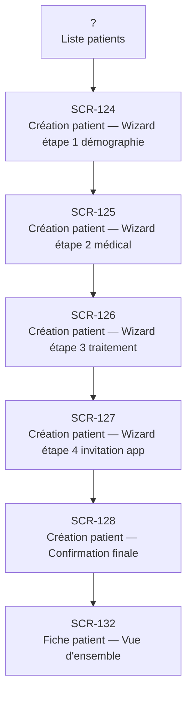

# J-01 — Première consultation patient

> 🟢 Priorité **MVP** · Persona **DOCTOR** · 7 écrans · 34 SP cumulés

---

## Séquence d'écrans

1. Liste patients
2. [SCR-124 — Création patient — Wizard étape 1 démographie](../by-category/04-patients/SCR-124-creation-patient-wizard-etape-1-demographie.md)
3. [SCR-125 — Création patient — Wizard étape 2 médical](../by-category/04-patients/SCR-125-creation-patient-wizard-etape-2-medical.md)
4. [SCR-126 — Création patient — Wizard étape 3 traitement](../by-category/04-patients/SCR-126-creation-patient-wizard-etape-3-traitement.md)
5. [SCR-127 — Création patient — Wizard étape 4 invitation app](../by-category/04-patients/SCR-127-creation-patient-wizard-etape-4-invitation-app.md)
6. [SCR-128 — Création patient — Confirmation finale](../by-category/04-patients/SCR-128-creation-patient-confirmation-finale.md)
7. [SCR-132 — Fiche patient — Vue d'ensemble](../by-category/05-fichepatient/SCR-132-fiche-patient-vue-d-ensemble.md)

---

## Représentation flow (Mermaid)

---

## Notes

- Ce parcours doit être validé par un PO produit avant développement
- Chaque écran de la séquence est documenté individuellement (cf liens ci-dessus)
- Tests E2E Playwright recommandés sur le parcours complet (1 spec par parcours critique)
