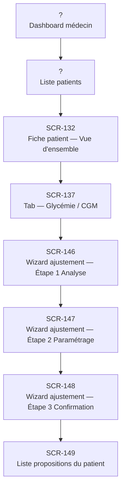

# J-02 — Analyse glycémie + ajustement insuline

> 🟢 Priorité **MVP** · Persona **DOCTOR** · 8 écrans · 55 SP cumulés

---

## Séquence d'écrans

1. Dashboard médecin
2. Liste patients
3. [SCR-132 — Fiche patient — Vue d'ensemble](../by-category/05-fichepatient/SCR-132-fiche-patient-vue-d-ensemble.md)
4. [SCR-137 — Tab — Glycémie / CGM](../by-category/05-fichepatient/SCR-137-tab-glycemie-cgm.md)
5. [SCR-146 — Wizard ajustement — Étape 1 Analyse](../by-category/06-ajustementproposition/SCR-146-wizard-ajustement-etape-1-analyse.md)
6. [SCR-147 — Wizard ajustement — Étape 2 Paramétrage](../by-category/06-ajustementproposition/SCR-147-wizard-ajustement-etape-2-parametrage.md)
7. [SCR-148 — Wizard ajustement — Étape 3 Confirmation](../by-category/06-ajustementproposition/SCR-148-wizard-ajustement-etape-3-confirmation.md)
8. [SCR-149 — Liste propositions du patient](../by-category/06-ajustementproposition/SCR-149-liste-propositions-du-patient.md)

---

## Représentation flow (Mermaid)

---

## Notes

- Ce parcours doit être validé par un PO produit avant développement
- Chaque écran de la séquence est documenté individuellement (cf liens ci-dessus)
- Tests E2E Playwright recommandés sur le parcours complet (1 spec par parcours critique)
