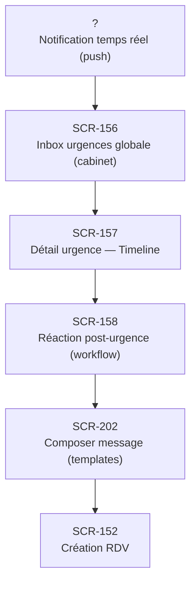

# J-03 — Réaction urgence patient (hypo sévère)

> 🟢 Priorité **MVP** · Persona **DOCTOR** · 6 écrans · 36 SP cumulés

---

## Séquence d'écrans

1. Notification temps réel (push)
2. [SCR-156 — Inbox urgences globale (cabinet)](../by-category/08-urgences/SCR-156-inbox-urgences-globale-cabinet.md)
3. [SCR-157 — Détail urgence — Timeline](../by-category/08-urgences/SCR-157-detail-urgence-timeline.md)
4. [SCR-158 — Réaction post-urgence (workflow)](../by-category/08-urgences/SCR-158-reaction-post-urgence-workflow.md)
5. [SCR-202 — Composer message (templates)](../by-category/15-messagerie/SCR-202-composer-message-templates.md)
6. [SCR-152 — Création RDV](../by-category/07-teleconsult/SCR-152-creation-rdv.md)

---

## Représentation flow (Mermaid)

---

## Notes

- Ce parcours doit être validé par un PO produit avant développement
- Chaque écran de la séquence est documenté individuellement (cf liens ci-dessus)
- Tests E2E Playwright recommandés sur le parcours complet (1 spec par parcours critique)
