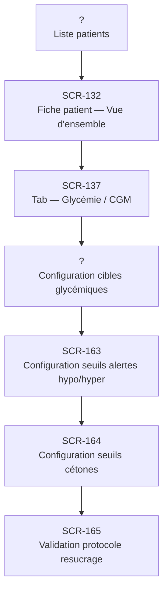

# J-04 — Configuration cibles + seuils alertes patient

> 🟢 Priorité **MVP** · Persona **DOCTOR** · 7 écrans · 36 SP cumulés

---

## Séquence d'écrans

1. Liste patients
2. [SCR-132 — Fiche patient — Vue d'ensemble](../by-category/05-fichepatient/SCR-132-fiche-patient-vue-d-ensemble.md)
3. [SCR-137 — Tab — Glycémie / CGM](../by-category/05-fichepatient/SCR-137-tab-glycemie-cgm.md)
4. Configuration cibles glycémiques
5. [SCR-163 — Configuration seuils alertes hypo/hyper](../by-category/09-configseuils/SCR-163-configuration-seuils-alertes-hypo-hyper.md)
6. [SCR-164 — Configuration seuils cétones](../by-category/09-configseuils/SCR-164-configuration-seuils-cetones.md)
7. [SCR-165 — Validation protocole resucrage](../by-category/09-configseuils/SCR-165-validation-protocole-resucrage.md)

---

## Représentation flow (Mermaid)

---

## Notes

- Ce parcours doit être validé par un PO produit avant développement
- Chaque écran de la séquence est documenté individuellement (cf liens ci-dessus)
- Tests E2E Playwright recommandés sur le parcours complet (1 spec par parcours critique)
