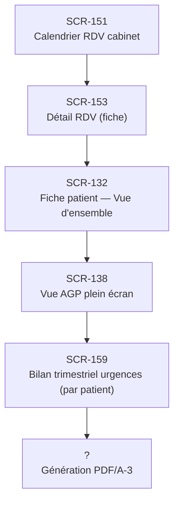

# J-05 — Bilan trimestriel patient avant consultation

> 🔵 Priorité **V1** · Persona **DOCTOR** · 6 écrans · 35 SP cumulés

---

## Séquence d'écrans

1. [SCR-151 — Calendrier RDV cabinet](../by-category/07-teleconsult/SCR-151-calendrier-rdv-cabinet.md)
2. [SCR-153 — Détail RDV (fiche)](../by-category/07-teleconsult/SCR-153-detail-rdv-fiche.md)
3. [SCR-132 — Fiche patient — Vue d'ensemble](../by-category/05-fichepatient/SCR-132-fiche-patient-vue-d-ensemble.md)
4. [SCR-138 — Vue AGP plein écran](../by-category/05-fichepatient/SCR-138-vue-agp-plein-ecran.md)
5. [SCR-159 — Bilan trimestriel urgences (par patient)](../by-category/08-urgences/SCR-159-bilan-trimestriel-urgences-par-patient.md)
6. Génération PDF/A-3

---

## Représentation flow (Mermaid)

---

## Notes

- Ce parcours doit être validé par un PO produit avant développement
- Chaque écran de la séquence est documenté individuellement (cf liens ci-dessus)
- Tests E2E Playwright recommandés sur le parcours complet (1 spec par parcours critique)
