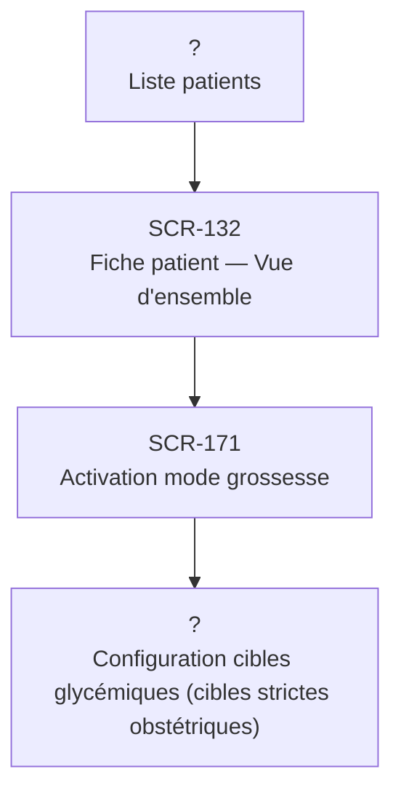

# J-06 — Activation mode grossesse

> 🟢 Priorité **MVP** · Persona **DOCTOR** · 4 écrans · 13 SP cumulés

---

## Séquence d'écrans

1. Liste patients
2. [SCR-132 — Fiche patient — Vue d'ensemble](../by-category/05-fichepatient/SCR-132-fiche-patient-vue-d-ensemble.md)
3. [SCR-171 — Activation mode grossesse](../by-category/10-modescontextuels/SCR-171-activation-mode-grossesse.md)
4. Configuration cibles glycémiques (cibles strictes obstétriques)

---

## Représentation flow (Mermaid)

---

## Notes

- Ce parcours doit être validé par un PO produit avant développement
- Chaque écran de la séquence est documenté individuellement (cf liens ci-dessus)
- Tests E2E Playwright recommandés sur le parcours complet (1 spec par parcours critique)
