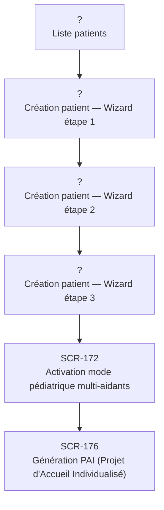

# J-07 — Onboarding parent + création compte enfant pédiatrique

> 🔵 Priorité **V1** · Persona **DOCTOR** · 6 écrans · 26 SP cumulés

---

## Séquence d'écrans

1. Liste patients
2. Création patient — Wizard étape 1
3. Création patient — Wizard étape 2
4. Création patient — Wizard étape 3
5. [SCR-172 — Activation mode pédiatrique multi-aidants](../by-category/10-modescontextuels/SCR-172-activation-mode-pediatrique-multi-aidants.md)
6. [SCR-176 — Génération PAI (Projet d'Accueil Individualisé)](../by-category/10-modescontextuels/SCR-176-generation-pai-projet-d-accueil-individualise.md)

---

## Représentation flow (Mermaid)

---

## Notes

- Ce parcours doit être validé par un PO produit avant développement
- Chaque écran de la séquence est documenté individuellement (cf liens ci-dessus)
- Tests E2E Playwright recommandés sur le parcours complet (1 spec par parcours critique)
