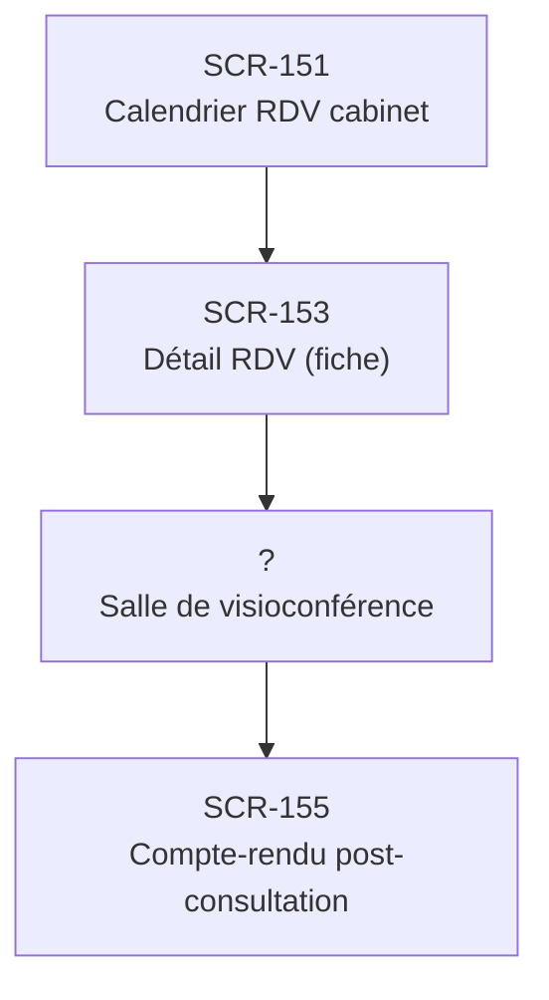

# J-08 — Téléconsultation (V4)

> 🔴 Priorité **V4** · Persona **DOCTOR** · 4 écrans · 19 SP cumulés

---

## Séquence d'écrans

1. [SCR-151 — Calendrier RDV cabinet](../by-category/07-teleconsult/SCR-151-calendrier-rdv-cabinet.md)
2. [SCR-153 — Détail RDV (fiche)](../by-category/07-teleconsult/SCR-153-detail-rdv-fiche.md)
3. Salle de visioconférence
4. [SCR-155 — Compte-rendu post-consultation](../by-category/07-teleconsult/SCR-155-compte-rendu-post-consultation.md)

---

## Représentation flow (Mermaid)

---

## Notes

- Ce parcours doit être validé par un PO produit avant développement
- Chaque écran de la séquence est documenté individuellement (cf liens ci-dessus)
- Tests E2E Playwright recommandés sur le parcours complet (1 spec par parcours critique)
