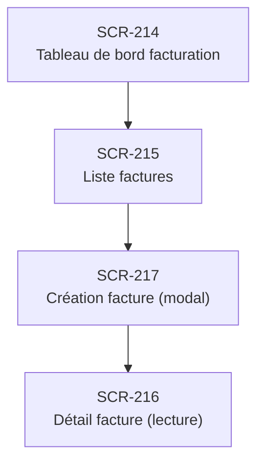

# J-09 — Création + envoi facture patient

> 🔵 Priorité **V1** · Persona **ADMIN** · 4 écrans · 23 SP cumulés

---

## Séquence d'écrans

1. [SCR-214 — Tableau de bord facturation](../by-category/17-facturation/SCR-214-tableau-de-bord-facturation.md)
2. [SCR-215 — Liste factures](../by-category/17-facturation/SCR-215-liste-factures.md)
3. [SCR-217 — Création facture (modal)](../by-category/17-facturation/SCR-217-creation-facture-modal.md)
4. [SCR-216 — Détail facture (lecture)](../by-category/17-facturation/SCR-216-detail-facture-lecture.md)

---

## Représentation flow (Mermaid)

---

## Notes

- Ce parcours doit être validé par un PO produit avant développement
- Chaque écran de la séquence est documenté individuellement (cf liens ci-dessus)
- Tests E2E Playwright recommandés sur le parcours complet (1 spec par parcours critique)
