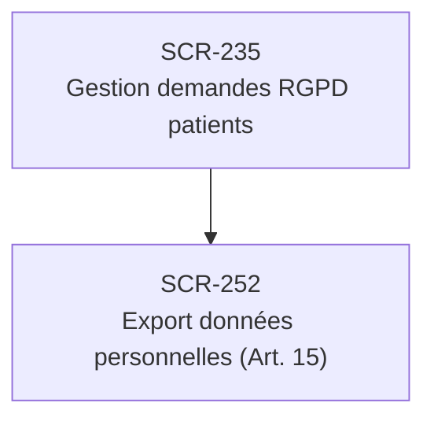

# J-11 — Demande RGPD patient (export Article 15)

> 🔵 Priorité **V1** · Persona **ADMIN** · 2 écrans · 13 SP cumulés

---

## Séquence d'écrans

1. [SCR-235 — Gestion demandes RGPD patients](../by-category/19-auditrgpd/SCR-235-gestion-demandes-rgpd-patients.md)
2. [SCR-252 — Export données personnelles (Art. 15)](../by-category/22-profil/SCR-252-export-donnees-personnelles-art-15.md)

---

## Représentation flow (Mermaid)

---

## Notes

- Ce parcours doit être validé par un PO produit avant développement
- Chaque écran de la séquence est documenté individuellement (cf liens ci-dessus)
- Tests E2E Playwright recommandés sur le parcours complet (1 spec par parcours critique)
