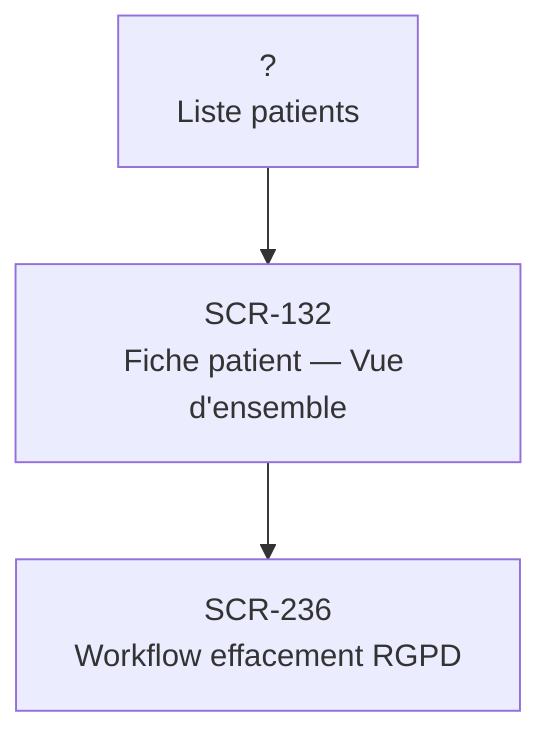

# J-12 — Effacement RGPD complet patient (Article 17)

> 🟢 Priorité **MVP** · Persona **ADMIN** · 3 écrans · 16 SP cumulés

---

## Séquence d'écrans

1. Liste patients
2. [SCR-132 — Fiche patient — Vue d'ensemble](../by-category/05-fichepatient/SCR-132-fiche-patient-vue-d-ensemble.md)
3. [SCR-236 — Workflow effacement RGPD](../by-category/19-auditrgpd/SCR-236-workflow-effacement-rgpd.md)

---

## Représentation flow (Mermaid)

---

## Notes

- Ce parcours doit être validé par un PO produit avant développement
- Chaque écran de la séquence est documenté individuellement (cf liens ci-dessus)
- Tests E2E Playwright recommandés sur le parcours complet (1 spec par parcours critique)
