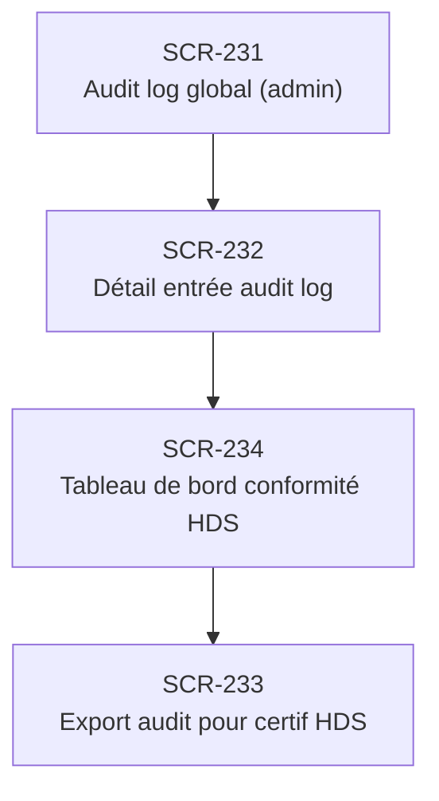

# J-13 — Audit interne (préparation contrôle HDS)

> 🔵 Priorité **V1** · Persona **ADMIN** · 4 écrans · 24 SP cumulés

---

## Séquence d'écrans

1. [SCR-231 — Audit log global (admin)](../by-category/19-auditrgpd/SCR-231-audit-log-global-admin.md)
2. [SCR-232 — Détail entrée audit log](../by-category/19-auditrgpd/SCR-232-detail-entree-audit-log.md)
3. [SCR-234 — Tableau de bord conformité HDS](../by-category/19-auditrgpd/SCR-234-tableau-de-bord-conformite-hds.md)
4. [SCR-233 — Export audit pour certif HDS](../by-category/19-auditrgpd/SCR-233-export-audit-pour-certif-hds.md)

---

## Représentation flow (Mermaid)

---

## Notes

- Ce parcours doit être validé par un PO produit avant développement
- Chaque écran de la séquence est documenté individuellement (cf liens ci-dessus)
- Tests E2E Playwright recommandés sur le parcours complet (1 spec par parcours critique)
