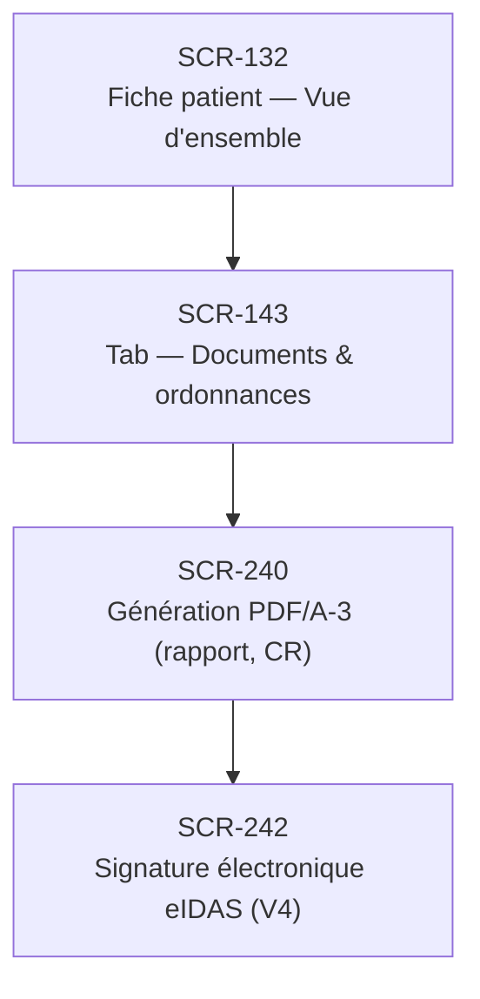

# J-14 — Création ordonnance numérique (V4)

> 🔴 Priorité **V4** · Persona **DOCTOR** · 4 écrans · 26 SP cumulés

---

## Séquence d'écrans

1. [SCR-132 — Fiche patient — Vue d'ensemble](../by-category/05-fichepatient/SCR-132-fiche-patient-vue-d-ensemble.md)
2. [SCR-143 — Tab — Documents & ordonnances](../by-category/05-fichepatient/SCR-143-tab-documents-ordonnances.md)
3. [SCR-240 — Génération PDF/A-3 (rapport, CR)](../by-category/20-documents/SCR-240-generation-pdf-a-3-rapport-cr.md)
4. [SCR-242 — Signature électronique eIDAS (V4)](../by-category/20-documents/SCR-242-signature-electronique-eidas-v4.md)

---

## Représentation flow (Mermaid)

---

## Notes

- Ce parcours doit être validé par un PO produit avant développement
- Chaque écran de la séquence est documenté individuellement (cf liens ci-dessus)
- Tests E2E Playwright recommandés sur le parcours complet (1 spec par parcours critique)
