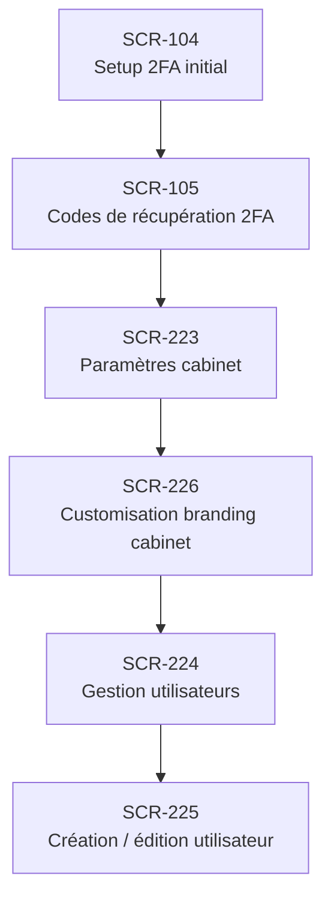

# J-15 — Configuration initiale cabinet (premier setup)

> 🟢 Priorité **MVP** · Persona **ADMIN** · 6 écrans · 27 SP cumulés

---

## Séquence d'écrans

1. [SCR-104 — Setup 2FA initial](../by-category/01-auth/SCR-104-setup-2fa-initial.md)
2. [SCR-105 — Codes de récupération 2FA](../by-category/01-auth/SCR-105-codes-de-recuperation-2fa.md)
3. [SCR-223 — Paramètres cabinet](../by-category/18-admin/SCR-223-parametres-cabinet.md)
4. [SCR-226 — Customisation branding cabinet](../by-category/18-admin/SCR-226-customisation-branding-cabinet.md)
5. [SCR-224 — Gestion utilisateurs](../by-category/18-admin/SCR-224-gestion-utilisateurs.md)
6. [SCR-225 — Création / édition utilisateur](../by-category/18-admin/SCR-225-creation-edition-utilisateur.md)

---

## Représentation flow (Mermaid)

---

## Notes

- Ce parcours doit être validé par un PO produit avant développement
- Chaque écran de la séquence est documenté individuellement (cf liens ci-dessus)
- Tests E2E Playwright recommandés sur le parcours complet (1 spec par parcours critique)
