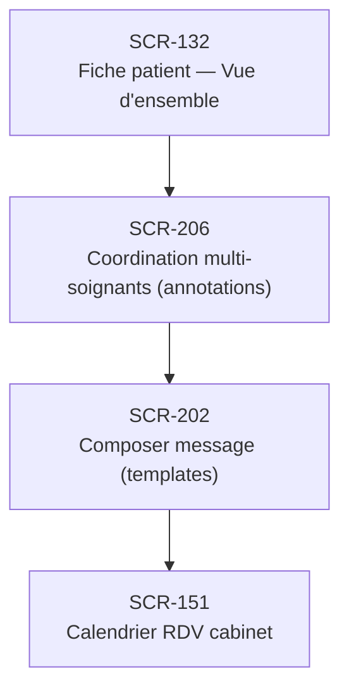

# J-17 — Coordination multi-soignants sur cas complexe

> 🟡 Priorité **V2** · Persona **DOCTOR + équipe** · 4 écrans · 26 SP cumulés

---

## Séquence d'écrans

1. [SCR-132 — Fiche patient — Vue d'ensemble](../by-category/05-fichepatient/SCR-132-fiche-patient-vue-d-ensemble.md)
2. [SCR-206 — Coordination multi-soignants (annotations)](../by-category/15-messagerie/SCR-206-coordination-multi-soignants-annotations.md)
3. [SCR-202 — Composer message (templates)](../by-category/15-messagerie/SCR-202-composer-message-templates.md)
4. [SCR-151 — Calendrier RDV cabinet](../by-category/07-teleconsult/SCR-151-calendrier-rdv-cabinet.md)

---

## Représentation flow (Mermaid)

---

## Notes

- Ce parcours doit être validé par un PO produit avant développement
- Chaque écran de la séquence est documenté individuellement (cf liens ci-dessus)
- Tests E2E Playwright recommandés sur le parcours complet (1 spec par parcours critique)
