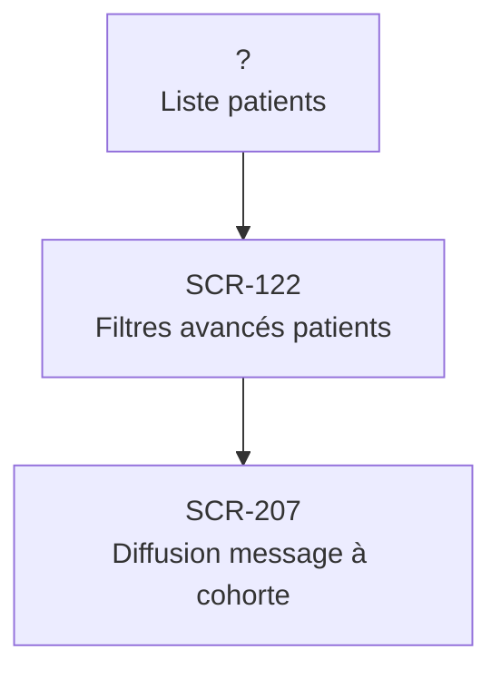

# J-18 — Diffusion message à cohorte (Ramadan)

> 🟠 Priorité **V3** · Persona **DOCTOR + ADMIN** · 3 écrans · 18 SP cumulés

---

## Séquence d'écrans

1. Liste patients
2. [SCR-122 — Filtres avancés patients](../by-category/04-patients/SCR-122-filtres-avances-patients.md)
3. [SCR-207 — Diffusion message à cohorte](../by-category/15-messagerie/SCR-207-diffusion-message-a-cohorte.md)

---

## Représentation flow (Mermaid)

---

## Notes

- Ce parcours doit être validé par un PO produit avant développement
- Chaque écran de la séquence est documenté individuellement (cf liens ci-dessus)
- Tests E2E Playwright recommandés sur le parcours complet (1 spec par parcours critique)
