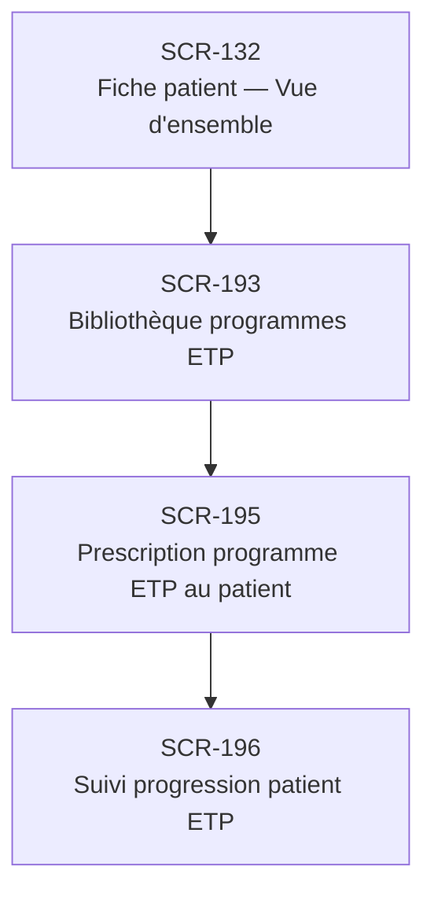

# J-19 — Prescription programme ETP

> 🟡 Priorité **V2** · Persona **DOCTOR** · 4 écrans · 23 SP cumulés

---

## Séquence d'écrans

1. [SCR-132 — Fiche patient — Vue d'ensemble](../by-category/05-fichepatient/SCR-132-fiche-patient-vue-d-ensemble.md)
2. [SCR-193 — Bibliothèque programmes ETP](../by-category/14-etp/SCR-193-bibliotheque-programmes-etp.md)
3. [SCR-195 — Prescription programme ETP au patient](../by-category/14-etp/SCR-195-prescription-programme-etp-au-patient.md)
4. [SCR-196 — Suivi progression patient ETP](../by-category/14-etp/SCR-196-suivi-progression-patient-etp.md)

---

## Représentation flow (Mermaid)

---

## Notes

- Ce parcours doit être validé par un PO produit avant développement
- Chaque écran de la séquence est documenté individuellement (cf liens ci-dessus)
- Tests E2E Playwright recommandés sur le parcours complet (1 spec par parcours critique)
